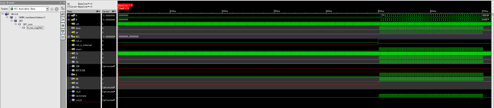

[appendix]
= Problematiche riscontrate nella simulazione gate-level

Durante lo sviluppo del progetto `device` (Multiplier and CLZ) sono state riscontrate significative problematiche nell'esecuzione delle simulazioni gate-level.

Queste criticità si sono manifestate già nella fase di analisi del netlist post-sintesi, a partire dai file generati dopo `syn_map` e `syn_opt`.

L'errore principale riportato dal simulatore Xcelium era il seguente:

[source, console]
[%autosize]
----
xmelab: *E,MXINDR: VHDL port of mode IN, :testbench:DUT<local>rst_n
(./device_pkg_NBITS32.vhdl: line 9), is connected below to a Verilog port,
:testbench:DUT.rst_n (../synth/output/device.syn_opt.v: line 13), with drivers.
----

Il segnale `rst_n`, presente nell'intestazione della netlist Verilog generata da Genus, risultava duplicato anche come `wire`, in conformità alla sintassi prodotta automaticamente dallo strumento.

Questo comportamento, pur formalmente corretto in Verilog, ha creato conflitti nella simulazione mixed-language (VHDL + Verilog), impedendo l'esecuzione regolare sotto ambiente Xcelium.

Per verificare l'origine del problema, sono stati effettuati test mirati, riducendo il `device` ad una sola istanza di flip-flop della libreria (`DFFR_X*` o `SDFFR_X*`).
Le forme d'onda generate in queste prove evidenziavano come il segnale di reset `rst_n` non fosse effettivamente forzato a `0` durante la fase iniziale, causando uno stato incerto (`X`) proprio nei momenti critici di inizializzazione dei registri.
Ciò comprometteva l'intero funzionamento gate-level, specialmente nel caso del progetto `device` completo, in quanto la mancanza di un reset certo portava a valori indefiniti sulle uscite fin dai primi cicli.

.Simulazione gate-leve, conflitto driver su `rst_n`
[#fig_appendix_syn_opt_rst_driver,reftext='{figure-caption} {counter:fignum}']

Dopo numerosi tentativi volti ad aggirare il problema — inclusi wrapper e testbench interamente scritti in Verilog — senza ottenere una soluzione funzionale o comunque non conforme al flusso originario del progetto, è stata trovata la strategia corretta.

Si è deciso di abbandonare la simulazione gate-level basata sui modelli Verilog `stdcells.v`, sostituendoli esclusivamente con le librerie `VITAL` VHDL fornite (`stdcells_Vcomponents.vhdl`, `stdcells_VITAL.vhdl`, `stdcells_Vtables.vhdl`).
Questa modifica ha eliminato i problemi di driver multipli sulle porte e ha consentito di riprendere il normale avanzamento del progetto.

I file gate-level generati tramite `syn_opt` sono stati quindi simulati con successo, senza conflitti sul segnale di reset, portando a termine le verifiche sul dispositivo `device` come descritto nel relativo capitolo.

[NOTE]
====
Questa esperienza ha messo in luce l'importanza di considerare con attenzione le interazioni fra linguaggi diversi (VHDL e Verilog) nei flussi misti, soprattutto quando si utilizzano librerie di standard cell che possono introdurre ambiguità nelle porte di reset o clock.
====
