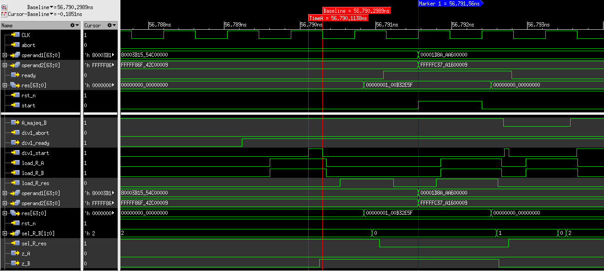

[#project_mcd]
= Progetto 4: Maximum Common Divisor (MCD)

Questa sezione analizza il dispositivo `MCD` come quarto componente nello studio del _design flow_ dei calcolatori elettronici.
Verranno analizzati il codice originale per spiegarne il funzionamento e fornire una rappresentazione grafica della sua Control Unit e Datapath.

Verranno poi spiegate le informazioni salienti sullo sviluppo dell'algoritmo di test e del testbench per valutare e verificare il dispositivo `MCD` a livello _RT_ e _gate_.

Infine, si concluderá il capitolo con valutazioni sulla sintesi del device ed i risultati ottenuti con la libreria tecnologica scelta.

== Code analysis

Il dispositivo é progettato per calcolare il _massimo comun divisore_ tra due numeri (operandi) forniti in ingresso.

Si ricorda la definizione:

[TIP]
====
Il massimo comun divisore di due numeri interi, entrambi non nulli, corrisponde al numero naturale più grande per il quale entrambi possono essere divisi esattamente.
====

Dall'analisi delle porte di _top-level_ del componente `mcd`, si ottiene il prospetto di <<table_mcd_IOports>> rappresentato poi in <<diag_mcd_io>>.

Il file `mcd.vhdl` contiene una rappresentazione strutturale del dispositivo, istanziando semplicemente control unit e datapath, insieme alla logica di collegamento interna ed alle porte.
Il dispositivo presenta un parametro `generic OPSIZE` di tipo intero, utilizzato per definire la larghezza in bit degli operandi e del risultato.

Il file `mcd_ctrl.vhdl` rappresenta la control unit del dispositivo in maniera comportamentale, implementando una semplice FSM (`ns_process`) per gestire le operazioni ed i segnali di controllo.
Lo stile utilizzato esplicita i segnali di load dei registri presenti nel datapath, ed i selettori dei multiplexer utilizzati attraverso statement concorrenti in maniera coerente con i dispositivi fin'ora analizzati.
Oltre la transizione degli stati, é visibile un _override_ ogniqualvolta il segnale `abort` viene settato.
Questo termina le eventuali operazioni in corso e riporta la CTRL-Unit allo stato `S_INIT`.
Si veda la rappresentazione ASM-chart in <<fig_mcd_ctrl>>.

Il file `mcd_dp.vhdl` implementa quindi il datapath in maniera gerarchica, istanziando il dispositivo `divider` al suo interno.
Come visibile in <<fig_mcd_dp>>, nel datapath vengono istanziati tre registri (`R_A`, `R_B`, `R_res`), due comparatori, un sommatore ed un componente che effettua la divisione.

I registri `R_A` ed `R_B` servono principalmente per trattenere gli operandi nelle fasi di elaborazione, mentre `R_res` salva il risultato dell'operazione.
Il sommatore, più propriamente un _sottrattore_, esplicita l'operazione di confronto `A >= B` attraverso le seguenti operazioni:

. Estende entrambi gli operandi sul MSB, aggiungendo uno `'0'` quale **MSB** (_Most Significant Bit_).
. Sottrae `R_B` da `R_A` (somma con complemento a due) interpretandoli senza segno.
.. `R_A + (~R_B + 1)`
. Il *MSB* del risultato indica se é un valore **non negativo**:
.. `MSB = 0` il risultato é nullo o positivo => `R_A >= R_B`
.. `MSB = 1` il risultato é negativo => `R_A < R_B`

Per il divisore si utilizza solo il segnale del _resto_ (`div1_remainder`) mentre il quoziente viene ignorato.

.Descrizione porte dispositivo `mcd`.
[%unbreakable]
[#table_mcd_IOports,subs="attributes+", reftext='{table-caption} {counter:tabnum}']
[cols="^2m,^2,6",options="header"]
|===

|Signal
|Direction
|Description

|abort
|IN
|Interrompe l'operazione in corso.

|operand1
|IN
|Primo operando per la ricerca del MCD.

|operand2
|IN
|Secondo operando per la ricerca del MCD.

|res
|OUT
|Risultato dell'elaborazione, MCD di `operand1` e `operand2`.

|start
|IN
|Segnale di `valid` per gli operandi in ingresso.
Richiede una nuova computazione del MCD.

|ready
|OUT
|Segnale di `valid` di `res`.
Indica che il risultato in uscita al dispositivo puó essere valutato.

|===

[#diag_mcd_io]
.Diagramma dispositivo `mcd`
[.center,svgbob-mcd_ports, reftext='{figure-caption} {counter:fignum}']
[svgbob]
----
                           +----------------+
   operand1[OPSIZE] ------>|                |
   operand2[OPSIZE] ------>|                |----> res [OPSIZE]
                           |                |
                           |      mcd       |
              start ------>|                |----> ready
              abort ------>|                |
                           |                |
                           +----------------+
----

=== Analisi dell'algoritmo

Giudicando dalla transizione degli stati e dalle risorse istanziate, si deduce che il dispositivo implementi link:https://it.wikipedia.org/wiki/Algoritmo_di_Euclide[l'algoritmo di Euclide] per trovare il massimo comun divisore tra due numeri interi.

La sequenza delle operazioni del dispositivo `mcd` é:

. `S_INIT`
.. Salva `operand1 => R_A`.
.. Salva `operand2 => R_B`.
. `S_SUBTR`
.. Se `R_A >= R_B` inizia una divisione (`div1_start`).
.. Altrimenti scambia gli operandi (usando `R_res` come registro temporaneo) ed effettua la divisione.
. `S_MOD_START` - `S_MOD_WAIT`
.. Divide `R_A / R_B` in attesa del resto (`div1_remainder`).
.. Quando `divider` ha completato, salva i nuovi valori nei registri:
... `R_B <= R_A mod R_B` (il resto).
... `R_A <= R_B`.
.. Reitera l'operazione di divisione.
... Termina quando uno dei due registri diventa zero.
... Restituisce il valore non-nullo in `R_res`

L'algoritmo di Euclide corrisponde a questo comportamento, come rappresentato dal <<source_mcd_euclid_python>> in codice python che lo descrive.

[#source_mcd_euclid_python]
.Algoritmo di Euclide per il MCD, python
[source, python, reftext='{listing-caption} {counter:listnum}']
----
def mcd(a, b):
    while b != 0:
        t = b
        b = a % b
        a = t

    return a
----

Si assume che il primo operatore sia maggiore o uguale al secondo, verifica che viene effettuata dal dispositivo sotto analisi.

Un'ulteriore accortezza é implementata in `mcd` nel caso in cui uno od entrambi gli operandi in ingresso siano uguali a zero.
In questo caso l'algoritmo non é valido, quindi il dispositivo ritorna semplicemente in `S_IDLE` con zero quale risultato in uscita.

==== Divider

Il divisore utilizzato nell'implementazione di `mcd` non é parte delle stesse analisi sul funzionamento e sulle risorse.
Tuttavia si considerano queste caratteristiche salienti a riguardo:

. Divisore multi-ciclo di interi
. Larghezza parametrica degli operandi e del risultato
. Algoritmo usato: link:https://en.wikipedia.org/wiki/Division_algorithm#Restoring_division[Restoring Division]
.. Per ogni bit del dividendo originale (gli operandi vengono raddoppiati in larghezza):
... Shift a sinistra del resto ed il prossimo bit del dividendo.
... Sottrae il divisore dal resto.
... Se la sottrazione é `>= 0`, imposta il bit del quoziente a 1.
... Altrimenti _ripristina_ il resto ed imposta il bit del quoziente a 0.
.. Al termine del loop si ottiene il resto ed il quoziente.

=== ASM Chart

La rappresentazione della CTRL-Unit del dispositivo `mcd` é visibile in <<fig_mcd_ctrl>>, dove si é apposto un flusso fuori dal normale controllo della FSM per indicare il comportamento del segnale `abort` quale _override_ del normale funzionamento.

Le risorse visibili nel datapath sono invece rappresentate in <<fig_mcd_dp>>.

Si é rappresentato il componente `divider` come un blocco gerarchico di cui si considera solo il comportamento alle porte di input e di output.
Il divisore appare come un dispositivo multi-ciclo, che inizia un'operazione al set del segnale `start` e segnala la validitá dei suoi output (quoziente e resto) tramite il segnale `ready`.

Risulta presente un segnale di `abort` per terminare prematuramente una divisione in corso.
Anche per il divisore é presente il `generic OPSIZE` corrispondente a quello del dispositivo `mcd` che controlla la larghezza in bit degli operandi e del risultato.

.ASM-Chart CTRL-Unit `mcd`
[#fig_mcd_ctrl,reftext='{figure-caption} {counter:fignum}']
image::images/ASM-mcd_ctrl.drawio.svg[]

.Risorse Datapath `mcd`
[#fig_mcd_dp,reftext='{figure-caption} {counter:fignum}']
image::images/ASM-mcd_dp.drawio.svg[]

== Tester e Testbench

Per osservare e verificare il funzionamento del dispositivo sono stati sviluppati un testbench ed un tester.
L'architettura di test segue l'impostazione vista nella sezione <<device_test_arch, relativa a `device`>>, con dei minimi aggiustamenti per il funzionamento di `mcd`.

// see https://ivanceras.github.io/svgbob-editor/

.Architettura di test: DUT e Tester
[.custom-style,svgbob-mcd_tb_arch, reftext='{figure-caption} {counter:fignum}']
[svgbob]
----
.------------------------------------------------------------------.
|                                                                  |
|                        +--------+                                |
|                        | rstgen |                                |
|                        +----+---+                                |
|                             |                                    |
|              +--------------+--------------+                     |
|              |                             |                     |
|              v                             v                     |
|        +----------+                   +-----------+              |
|        |          |                   |           |              |
|        |          | abort ----------->|           |              |
|        |          | start ----------->|           |              |
|        |          |                   |           |              |
|        |          | operand1 -------->|           |              |
|        |  tester  | operand2 -------->|    mcd    |              |
|        |          |                   |           |              |
|        |    {tg}  | <------------ res |   {dut}   |              |
|        |          | <---------- ready |           |              |
|        |          |                   |           |              |
|        |          | finished ---+     |           |              |
|        +----------+             |     +-----------+              |
|          ^                      |            ^                   |
|          |                      v            |                   |
|          |   +-------+       +----------+    |                   |
|          |   |  clk  |       |  finish  |    |                   |
|          |   |  gen  |<------+   proc   |    |                   |
|          |   +---+---+       +----------+    |                   |
|          |       |                           |                   |
|          +-------+---------------------------+                   |
|                                                      {tb}        |
|                                                      testbench   |
'------------------------------------------------------------------'

# Legend:
tb = {
    fill: papayawhip;
}
tg = {
    fill: lightblue;
}
dut = {
    fill: lightyellow;
}
----

Il diagramma ASM relativo al `tester` ricalca quello usato per il dispositivo `multiplier_and_clz`, con le opportune modifiche per confrontare il risultato nel processo `check`.

.Flow-chart Tester `mcd`
[#fig_asm_tester_mcd,reftext='{figure-caption} {counter:fignum}']
image::images/ASM-mcd_tester.drawio.svg[align="center"]

Il segnale `abort` non è testato esplicitamente, ma si attiva solo se un operando è nullo, saltando così anche il controllo in `check`; il `tester` prosegue quindi con altri valori casuali.

Tale condizione non si verifica poiché `lfsr_pkg` usa polinomi che rendono zero elemento assorbente e non raggiungibile, evitando registri bloccati.
Il `lfsr` si inizializza via `SEED`.

Il parametro `NTESTS` è configurabile con `generic override` da linea di comando. Il `tester` genera operandi pseudo-casuali e confronta il risultato con <<source_mcd_sw_check>>, come da specifiche.

[#source_mcd_sw_check]
.Calcolo *MCD*, funzione ricorsiva per `tester`
[%unbreakable]
[source, vhdl, reftext='{listing-caption} {counter:listnum}']
----
    function mcd_r(op1: unsigned; op2: unsigned) return unsigned is
    begin
        if op2 > op1 then
            return mcd_r(op2, op1);
        else
            if op2 = 0 then
                return op1;
            else
                return mcd_r(op2, op1 rem op2);
            end if;
        end if;
    end;
----

Questa versione di calcolo del *MCD* differisce da quella implementativa per la ricorsivitá, ma si assume che il risultato sia equivalente in assenza di errori nel dispositivo `mcd`.

.Simulations, Synthesis and Evaluations

In questa sezione verranno presentati i risultati e le valutazioni relative alle diverse simulazioni del dispositivo `mcd`.

Sono state impostate larghezze di `16` , `32` e `64` bit per gli operandi ed il risultato, con `NTESTS >= 10000` per ogni simulazione.

== RTL Simulations

Per le simulazioni RTL, é stato utilizzato `GHDL`, attraverso il _workflow_ giá sperimentato con gli altri progetti, tramite l'<<script_ghdl, helper script ghdl>>.
Considerato che lo script indica autonomamente al tool di salvare i segnali in un output `<prj_name>.ghw` per l'ispezione delle forme d'onda, e che questo richiede un certo tempo e puó raggiungere dimensioni notevoli (`1.3GB` per `NTESTS=20000` e `OPSIZE=32`), si consiglia di eliminare la sezione di salvataggo dallo script (commentando per esempio la linea `SIM_ARGS+="--wave=${WAVE_FILE} "`).
Alternativamente si puó modificare il formato di uscita in `.vcd` per ottenere un output leggermente più "snello".

Gli operandi vengono di volta in volta ottenuti casualmente, perció i risultati saranno per la maggior parte delle volte poco interessanti (ci si aspetta una grandissima presenza di *MCD* uguali a `1`).
Si é quindi aggiunta una sezione al processo `check` del `tester` dove i risultati considerati interessanti vengono stampati su `stdout`.
I criteri per definire i risultati interessanti sono:

. *MCD* é superiore ad una certa soglia
. *MCD* é uguale ad uno dei due operandi

Per abilitare questo _report_, bisogna definire la variabile `VERBOSE` come nel caso di maggiore verbositá per gli eventuali errori.
La soglia di interesse é altrettanto configurabile da linea di comando come generic override del parametro `MCD_THRESH`.

Con un comando di esecuzione come da <<source_mcd_rtl_run>>, si otterranno dei report della forma del <<source_mcd_rtl_report>>.

Questi risultati sono giá stati confrontati e verificati dalla funzione ricorsiva inclusa in `tester`, ma permettono di ritrovare più agevolmente il punto saliente nelle forme d'onda qual'ora si volesse praticare un'analisi più approfondita dei segnali.

[#source_mcd_rtl_run]
.Esempio comando simulazione RTL `mcd` per report dettagliati
[%autofit]
[%unbreakable]
[source, console, reftext='{listing-caption} {counter:listnum}']
----
ghdl -e -v --std=93c -gOPSIZE=32 -gNTESTS=100 -gVERBOSE=true -gMCD_THRESH=10  testbench
ghdl -r -v --std=93c  --time-resolution=ns -gOPSIZE=32 -gNTESTS=100 -gVERBOSE=true -gMCD_THRESH=10  testbench
----

[#source_mcd_rtl_report]
.Esempio report dettagliato simulazione RTL `mcd`
[%unbreakable]
[source, console, reftext='{listing-caption} {counter:listnum}']
----
...
Interesting result at 43077 cycles:
  A   = 10001111000111001000001111010000
  B   = 10111011111111111000011011111001
  mcd = 00000000000000000000000000001111
Interesting result at 44035 cycles:
  A   = 11100011110001110010000011110100
  B   = 00101110111111111110000110110101
  mcd = 00000000000000000000000000011101
Interesting result at 50599 cycles:
  A   = 10110010111110001111000111001000
  B   = 00111101000010111011111111110111
  mcd = 00000000000000000000000000110011
Interesting result at 52618 cycles:
  A   = 01011011001011111000111100011100
  B   = 10000011110100001011101111111000
  mcd = 00000000000000000000000000001100
Interesting result at 57682 cycles:
  A   = 11110100001011011001011111000111
  B   = 10001110010000011110100001010100
  mcd = 00000000000000000000000000001101
TEST PASS: 100 tests
----

.Forme d'onda risultato esempio `mcd`
[#fig_mcd_interesting_result,reftext='{figure-caption} {counter:fignum}']

In <<fig_mcd_interesting_result>> si puó osservare l'operazione in cui il risultato é `MCD = 15`.

[#mcd_rtl_reports]
I report ottenuti dalle simulazioni sono presenti nella cartella `simul.rtl`:

. `report_rtl_NTESTS_15000_OPSIZE_16.txt`
. `report_rtl_NTESTS_15000_OPSIZE_32.txt`
. `report_rtl_NTESTS_15000_OPSIZE_64.txt`

Nei documenti sono stati mantenuti anche i comandi generati dallo script, per completezza e ripetibilitá degli stessi.
Inoltre, per verificare ulteriormente i risultati ottenuti e trascritti nei report, é stato utilizzato uno script che accetta in ingresso il file da analizzare e ripete le operazioni indicate.
Lo script, in _python_, utilizza il calcolo della libreria `math` per il link:https://github.com/python/cpython/blob/3f9eb55e090a8de80503e565f508f341c5f4c8da/Modules/mathmodule.c#L710[massimo comun divisore].
I file vengono analizzati ed i valori `bitvector` riconvertiti in opportuni interi senza segno, ed il risultato documentato viene confrontato con quello ricalcolato.
Per ogni controllo viene poi stampato un messaggio relativo al successo (`[ Ok ]`) o meno (`[FAIL]`) della verifica.

Lo script é presente al percorso `scripts/parse_and_check_mcd.py`.

.Esempio di output dello script di verifica dei report
[%unbreakable]
[source, console, reftext='{listing-caption} {counter:listnum}']
----
$ scripts/parse_and_check_mcd.py projects/04_mcd/simul.rtl/report_rtl_NTESTS_15000_OPSIZE_32.txt
[ OK ] At 129430 cycles: MCD correct (716)
[ OK ] At 129740 cycles: MCD correct (358)
[ OK ] At 1004666 cycles: MCD correct (370)
...
[ OK ] At 8250365 cycles: MCD correct (339)
[ OK ] At 9162142 cycles: MCD correct (514)
>>> All results are correct.
----

Al termine delle simulazioni RTL e verifiche, non si evidenziano note particolari: il dispositivo `mcd` risulta deterministico e corretto sui casi casuali.

Come per <<project_device, Multiplier and CLZ>>, è fornito uno script `scripts/rtl_xcelium` per lanciare la simulazione RTL con `Xcelium`.
Per default lo script `scripts/rtl_xsim.tcl` non salva i database delle forme d'onda (richiede modifica per abilitarli), ma genera i file `saif` in `simul.rtl/mcd_OPSIZE{16,32,64}.saif` usati poi dal flusso `genus`.

È quindi necessario eseguire almeno una simulazione RTL con `rtl_xcelium` per ciascun `OPSIZE` prima della sintesi.
Lo script effettua 15000 test con `OPSIZE=32` di default; per cambiare valori, passare `<OPSIZE> <NTESTS>` come argomenti interi.

[#cli_mcd_rtl_xcelium]
.Script per simulazione RTL Xcelium `mcd` con `OPSIZE => 16` e `NTESTS => 100`
[source, console, reftext='{listing-caption} {counter:listnum}']
----
~/04_mcd$ scripts/rtl_xcelium 16 100
----

== Stdcells synthesis

Come per il `device` del <<project_device>>, il flusso di sintesi è gestito interamente dallo script `tcl` `scripts/genus.tcl`.

Il setup delle cartelle e l`esecuzione del tool avvengono tramite `scripts/synth_genus`, identico per flusso al caso precedente (vedi <<mcd_synth_flow>>).

Per comodità, `scripts/genus` accetta un argomento intero per `OPSIZE`, analogo a quanto illustrato in <<cli_mcd_rtl_xcelium>>.

[%unbreakable]
[#mcd_synth_flow]
.Flusso di sintesi con script `genus.tcl`
. Setup dell'environment (`synth_genus`)
.. Preparazione cartelle di sintesi
.. Preparazione variabili di ambiente
. Chiamata a `genus -batch`
.. Acquisizione variabili da ambiente (`genus.tcl`)
.. Setup variabili, libreria e HDL
.. Setup nodo tecnologico e constraints
... Clock domain (unico - CLK)
... Input delay
... Output delay
... I/O driving cell e output load
... Segnale di reset (indicazione sincronizzatore di reset)
.. Setup e connessione DFT
.. Sintesi generica
.. Sintesi _mapping_
.. Sintesi ottimizzata
.. Scrittura report

La configurazione della sintesi é la seguente

*Tool*::
- Cadence Genus(TM) Synthesis Solution, Versione: 19.14-s108_1
*Stdcell*::
- Stdcell Nangate v2011.01-HR04-2011-01-19
- Tensione nominale: 1.10V
- Nodo tecnologico: 40nm
*DFT*::
- Muxed-scan
*Constraints*::
- Frequenza di clock: 1GHz (periodo di 1ns) - Jitter del 5%
- Driving cell: BUF_X8
- Capacità di uscita: 0.006585 pF
- Ritardo di ingresso: 0.4ns (40% del periodo di clock)
- Ritardo di uscita: 0.4ns (40% del periodo di clock)
*Configurazione del dispositivo*::
- `OPSIZE`: {16, 32, 64}

[WARNING]
====
Il target del periodo di clock per il tool `Genus` con il dispositivo `mcd` viene effettivamente impostato a 990ps.

Al valore `$clock_time` viene sottratto `$clk_margin` (10ps) per restringere artificialmente l'effort di ottimizzazione dello strumento di sintesi.
A tutti gli effetti, questo garantisce una _guard-band_ forzata di 10ps per la chiusura del timing.

Questo implica che ai risultati dei report esposti bisogna considerare l'aggiunta o rimozione di questo margine, in quanto si considera che il dispositivo `mcd` lavori comunque ad 1GHz.
====

La motivazione per l'inserimento della _guard-band_ artificiale é data dalla presenza di diversi path combinatori profondi nel design `mcd`, e la conseguente difficoltá dello strumento di sintesi a chiudere il timing prima dell'ottimizzazione.
Ispezionando per esempio il dispositivo sintetizzato `mcd_OPSIZE32` con il comando `report_logic_levels_histogram` si contano 98 percorsi con un numero di livelli logici maggiore a 12, di cui 24 hanno profonditá 16.

.Istogramma numero livelli logici sintesi `mcd_OPSIZE32`
[#listing_mcd_32_logic_levels]
[%autofit]
[%unbreakable]
[source, tcl, reftext='{listing-caption} {counter:listnum}']
----
@genus:root: 7> report_logic_levels_histogram
 ---------------------------------------------------------------------------------------------------
| Number of Logic Levels |     Number(%)   | Histogram
 ---------------------------------------------------------------------------------------------------
|        0  ->    3      |    340(62.8)    | **************************************************************
|        4  ->    7      |      4( 0.7)    |
|        8  ->   11      |     99(18.3)    | ******************
|       12  ->   15      |     74(13.7)    | *************
|       16  ->   19      |     24( 4.4)    | ****
 ---------------------------------------------------------------------------------------------------
|       16(worst)       |    541          | total end points
 ---------------------------------------------------------------------------------------------------
  View: 'analysis_view:mcd_OPSIZE32/default_emulate_view'
----

Vista la semplicitá del componente non si effettua un'analisi su tali percorsi volta a spezzarli tramite l'introduzione di appositi registri, attivitá che altrimenti sarebbe opportuna in un contesto più stringente (maggiore complessitá) o di violazione del timing.

In aggiunta, la libreria utilizzata presenta celle relativamente piccole ed a basso consumo, non fornendo particolari strumenti alla sintesi per ottenere margini più grandi, risultando quindi in un WNS pari a 0.

Seppur valido dal punto di vista dei requisiti - lo slack deve solamente essere _non negativo_ - un margine nullo, o troppo piccolo, non fornisce sufficiente tolleranza per le fasi successive di design ed implementazione fisici.

Pur considerando che `mcd` non verrá correntemente implementato su silicio, si é scelto di introdurre questa forzatura per garantire un margine noto sui risultati ottenuti e come esplorazione didattica.

Le metriche ottenute dalla sintesi di `mcd` per i valori di `OPSIZE => {16,32,64}` sono presentati in tabella <<table_mcd_syn_opt_results>>, dove il report sul consumo di potenza é basato sull'attivitá di switching ottenuta dalle simulazioni RTL.
Gli stessi risultati vengono plottati nel grafico <<plt_mcd_syn_opt_results>>

[WARNING]
====
La copertura dell'annotazione dei file `saif` in questo punto é insufficiente per quanto riguarda i segnali interni e flip-flop (con un minimo dello 0.47%), quindi risulterá necessario confrontare la potenza stimata in condizione _post-gate-level_.
====

Come mostrano i dati, con `OPSIZE => 32` il dispositivo `mcd` raggiunge un buon equilibrio _power-performance-area_, pur con un minor margine di slack, mentre le altre metriche crescono linearmente col raddoppio di `OPSIZE`.

Grazie al margine sul periodo di clock, anche con operandi a 64 bit i risultati restano accettabili, rendendo la scelta di `OPSIZE` sostanzialmente indipendente dal trade-off _PPA_ e guidata solo da esigenze funzionali.

Va però notato che, in un`integrazione più complessa, potrebbe servire inserire registri o pipeline per spezzare i path combinatori, con un impatto crescente sull`area all`aumentare di `OPSIZE`.

.Risultati sintesi `mcd` con `OPSIZE => {16, 32, 64}`
[%unbreakable]
[#table_mcd_syn_opt_results,subs="attributes+",reftext='{table-caption} {counter:tabnum}']
[cols="^.^1m,^.^1,^.^1,^.^1,^6a",frame="ends",grid="rows",options="header"]
|===

|`OPSIZE`
|Slack (ps)
|Area (µm²)
|Cells
|Pwr (W)

|16
|10+5
|1214.822
|582
// Nested table
|
[cols="^1m,^1m,^1m,^1m",grid="none", frame="none"]
!===
!Leakage !Internal !Switching !Total
!2.35010e-05
!8.42517e-04
!3.14307e-04
!1.18032e-03
!===

|32
|10+4
|2363.144
|1197
// Nested table
|
[cols="^1m,^1m,^1m,^1m",grid="none", frame="none"]
!===
!Leakage !Internal !Switching !Total
!4.48811e-05
!1.59603e-03
!6.56516e-04
!2.29743e-03
!===

|64
|10+0
|4746.504
|2483
// Nested table
|
[cols="^1m,^1m,^1m,^1m",grid="none", frame="none"]
!===
!Leakage !Internal !Switching !Total
!9.12643e-05
!3.01993e-03
!1.21231e-03
!4.32350e-03
!===

|===

.`mcd` design metrics vs `OPSIZE`
[#plt_mcd_syn_opt_results,subs="attributes+"reftext='{figure-caption} {counter:fignum}']
[gnuplot, align="center"]
....
set title "Design metrics vs OPSIZE"
set xlabel "OPSIZE"
set xtics ( "16" 16, "32" 32, "64" 64)

set ylabel "Slack (ps)"
set y2label "Area (μm²) / Cells / Power (uW)"
set y2tics

# Squeeze the left axis range
set yrange [-5:20]

# Move legend on top outside
set key outside top center horizontal

# Dashed line at Slack=10 with label
set arrow from graph 0, first 10 to graph 1, first 10 nohead dashtype 2 lc rgb "gray"
set label "clk margin" at graph 0.02, first 11 tc rgb "gray"

# Style definitions
set style data linespoints
set style line 1 lc rgb '#1f77b4' lw 2 pt 7
set style line 2 lc rgb '#ff7f0e' lw 2 pt 5
set style line 3 lc rgb '#2ca02c' lw 2 pt 9
set style line 4 lc rgb '#d62728' lw 2 pt 13

$slack << EOD
16 15
32 14
64 10
EOD

$area << EOD
16 1215
32 2363
64 4747
EOD

$cells << EOD
16 582
32 1197
64 2483
EOD

$power << EOD
16 1180
32 2297
64 4323
EOD

plot \
    $slack using 1:2 axes x1y1 with linespoints ls 1 title "Slack (ps)", \
    $area using 1:2 axes x1y2 with linespoints ls 2 title "Area (μm²)", \
    $cells using 1:2 axes x1y2 with linespoints ls 3 title "Cells", \
    $power using 1:2 axes x1y2 with linespoints ls 4 title "Power (fW)"
....

== Gate-level Simulations

Le simulazioni gate-level seguono lo stesso flusso e impiegano gli stessi strumenti descritti per il progetto `Multiplier and CLZ`.
I parametri `OPSIZE` e `NTESTS` possono essere specificati da riga di comando come argomenti ordinati dello script `scripts/gl_xcelium`.

[WARNING]
====
Lo script `gl_xcelium` **rimuove** la directory `simul.gate/work/` a ogni esecuzione.
Si raccomanda quindi di salvare o archiviare eventuali dati di interesse prima di avviare una nuova _run_.
====

Per uniformare il framework agli output della sintesi — che produce file denominati `mcd_OPSIZE*` — nella cartella `simul.gate/` sono stati predisposti tre _packages_ e un _testbench_ distinti, ciascuno legato a una specifica dimensione `OPSIZE` e dunque a un valore tra `{16, 32, 64}`.

Le modifiche ai sorgenti in versione gate-level sono state volutamente minimali, limitandosi all`istanza del _DUT_ corretto (senza `generic`) e alla connessione delle porte dedicate al `DFT`.

Le simulazioni in condizioni nominali hanno dato esito positivo fino a 1000 test, confermando che la funzionalità del circuito si mantiene inalterata anche dopo il processo di sintesi.
In presenza dei file SDF generati dal tool di sintesi — integrabili tramite l`opzione `-sdf` dello script `gl_xcelium` — sono stati invece rilevati risultati di particolare interesse.

I test si sono infatti mantenuti validi fino a periodi di clock sorprendentemente ridotti.
Per `OPSIZE` pari a `16` e `32` bit, il dispositivo opera correttamente fino a `840 ps` (circa `1.2 GHz` con duty cycle `50%`); nel caso `64` bit la soglia si alza lievemente a `870 ps`, restando comunque al di sotto del target nominale di `1 GHz`.

Una spiegazione plausibile di questo ampio margine risiede nella natura degli stimoli utilizzati.
L`analisi RTL evidenzia infatti una copertura estremamente bassa sui flip-flop interni (meno dell'1%), a fronte di una copertura sui pin I/O superiore al 94%.
Considerando che il circuito calcola il massimo comune divisore (MCD), è verosimile che i bit più significativi dei risultati vengano raramente esercitati.

Questa ipotesi trova conferma parziale nei report RTL: solo poche centinaia di risultati coinvolgono più dei tre bit meno significativi, e solo sporadicamente — nel caso `OPSIZE64` — si osservano transizioni oltre l`undicesimo bit (con un unico caso rilevato fino al tredicesimo).

Se i percorsi critici coincidono proprio con tali segnali poco sollecitati, si spiega come il circuito si mantenga stabile fino a frequenze tanto elevate, pur senza riflettere necessariamente il limite fisico reale.

Tuttavia i report di timing (`report_timing -max_paths 10`) indicano che quasi tutti i cammini più lenti coinvolgono il registro `R_B` del modulo `divider`, relativo al secondo operando.
Validare quindi in modo conclusivo l'ipotesi formulata richiederebbe un`analisi approfondita della chiusura del timing in fase di sintesi, nonché uno studio mirato del componente `divider`, attività che esulano dagli obiettivi e dalle tempistiche di questo progetto.

Un riepilogo dei risultati delle simulazioni gate-level è riportato nella <<table_mcd_gl_result>>.
In <<fig_mcd_gl_glitch_and_fail>> sono invece mostrate le forme d`onda gate-level al momento di un errore (`CLK_PERIOD => 840 ps`, `OPSIZE => 64`, `Time: 56791.56`).

Pur non essendo causa diretta del malfunzionamento, si evidenziano alcuni glitch sul segnale di ingresso al datapath `div1_start`, presenti in istanti diversi e di entità variabile.

[%unbreakable]
.Risultati simulazioni gate-level
[#table_mcd_gl_result,subs="attributes+",reftext='{table-caption} {counter:tabnum}']
[cols="^.^1m,^.^2,^.^2a,^2a",frame="ends",grid="rows",options="header"]
|===

|`OPSIZE`
|`NTESTS`
|Result
|Time

|16
|1000
|_Pass_
|
----
real    0m27.157s
user    0m13.537s
----

|32
|1000
|_Pass_
|
----
real    1m23.134s
user    1m9.707s
----

|64
|1000
|_Pass_
|
----
real    7m49.197s
user    7m35.451s
----

|===

.Simulazione gate-leve, `mcd_OPSIZE64`, risultato errato e glitch
[#fig_mcd_gl_glitch_and_fail,reftext='{figure-caption} {counter:fignum}']

== Other evaluations

Dall’analisi dei dati si osserva una crescita pressoché proporzionale dei consumi passando da 16 a 64 bit, sia prima che dopo il livello gate-level.

Si nota però un incremento percentuale della componente `Internal` post-sintesi, particolarmente marcato per la configurazione a 64 bit, dove supera il 77% del totale.
Questo risultato è coerente con l’introduzione di logica aggiuntiva dovuta al supporto DFT e alle ottimizzazioni di timing applicate dal tool di sintesi.

La <<table_mcd_pwr_eval>> conclusiva della sezione riassume i dati relativi alla dissipazione di potenza.

[%unbreakable]
.Consumi post-gate-level (W)
[#table_mcd_pwr_eval,subs="attributes+",reftext='{table-caption} {counter:tabnum}']
[cols="^.^1m,^.^2,^2m,^2m,^2m,^2m,^2m",frame="ends",grid="rows",options="header"]
|===

|`OPSIZE`
|Stage
|Category |Leakage |Internal |Switching |Total

// ##############################################
// Nested table
|16
|Pre Synth
5+a|
[cols="^2m,^2m,^2m,^2m,^2m",grid="none", frame="none"]
!===

!Subt.
!2.35010e-05
!8.42517e-04
!3.14307e-04
!1.18032e-03

!%
!1.99%
!71.38%
!26.63%
!100.00%
!===
// ==============================================

// Nested table
|16
|Post GL
5+a|
[cols="^2m,^2m,^2m,^2m,^2m",grid="none", frame="none"]
!===

!Subt.
!2.37557e-05
!9.72416e-04
!3.35012e-04
!1.33118e-03

!%
!1.78%
!73.05%
!25.17%
!100.00%
!===
// ==============================================

// ##############################################
// Nested table
|32
|Pre Synth
5+a|
[cols="^2m,^2m,^2m,^2m,^2m",grid="none", frame="none"]
!===

!Subt.
!4.48811e-05
!1.59603e-03
!6.56516e-04
!2.29743e-03

!%
!1.95%
!69.47%
!28.58%
!100.00%
!===
// ==============================================

// Nested table
|32
|Post GL
5+a|
[cols="^2m,^2m,^2m,^2m,^2m",grid="none", frame="none"]
!===

!Subt.
!4.56188e-05
!1.71217e-03
!5.32327e-04
!2.29011e-03

!%
!1.99%
!74.76%
!23.24%
!100.00%
!===
// ==============================================

// ##############################################
// Nested table
|64
|Pre Synth
5+a|
[cols="^2m,^2m,^2m,^2m,^2m",grid="none", frame="none"]
!===

!Subt.
!9.13908e-05
!3.07493e-03
!1.25575e-03
!4.42207e-03

!%
!2.07%
!69.54%
!28.40%
!100.00%
!===
// ==============================================

// Nested table
|64
|Post GL
5+a|
[cols="^2m,^2m,^2m,^2m,^2m",grid="none", frame="none"]
!===

!Subt.
!9.29084e-05
!3.12194e-03
!8.10391e-04
!4.02524e-03

!%
!2.31%
!77.56%
!20.13%
!100.00%
!===
// ==============================================

|===

---
