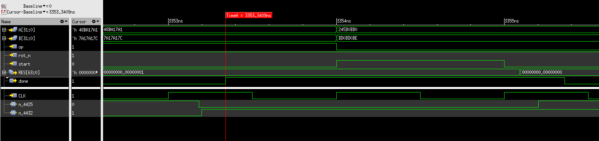

[#project_device]
= Progetto 3: Multiplier and Count Leading Zeroes

Questa sezione analizza il dispositivo d'esempio, chiamato semplicemente `device`.
Il componente é rappresentato dalle seguenti porte di input/output.

[table_device_IOports,subs="attributes+"]
[cols="^2m,^2,6",options="header"]
|===

|Signal
|Direction
|Description

|start
|IN
|Inizia una nuova operazione con gli operandi presentati.

|op
|IN
|Seleziona quale operazione effettuare sugli ingressi.

`@0`: Moltiplicazione di `A` per `B`.

`@1`: _Count leading zeroes_ (*CLZ*) di `A`.

|A
|IN
|Primo operando per la moltiplicazione.

Operando dove eseguire *CLZ*.

|B
|IN
|Secondo operando per la moltiplicazione.

|done
|OUT
|Segnale di `valid` di `RES`.
Indica che il risultato in uscita al dispositivo puó essere valutato.

|RES
|OUT
|Risultato dell'elaborazione dipendente da `op`.

|===

[.center,svgbob-device_ports]
[svgbob]
----
                +----------------+
    A[n] ------>|                |
    B[n] ------>|                |----> RES [2n]
                |                |
                |     device     |
   start ------>|                |----> done
      op ------>|                |
                |                |
                +----------------+
----

Il dispositivo implementa quindi due diverse operazioni aritmetiche sugli operandi di ingresso `A` e `B`, in base al valore del segnale `op`: moltiplicazione `A*B` oppure conteggio dei _most-significant-bit_ a `0` di `A`.

Il comportamento della CTRL-Unit del dispositivo viene descritto insieme al datapath nello stesso file `device.vhdl`.
Il flusso é rappresentato nel seguente ASM-Chart:

.`device` ASM-Chart CTRL-Unit
[#fig_device_ctrl,reftext='{figure-caption} {counter:refnum}']
image::images/ASM-device_ctrl.drawio.svg[]

Risulta disponibile un'infrastruttura di test composta da `testbench` che istanzia i generatori di reset e clock, ed il dispositivo `device` collegato ad un generatore di stimoli, `tester`.
Il flusso di test implementato é riassunto come segue:

. Testa diversi operandi.
.. Testa entrambe le operazioni.
. Verifica il risultato proposto confrontandolo con il risultato ottenuto dal software.
. Al termine della sequenza stampa un messaggio relativo al successo o meno del test.

Opzionalmente si puó definire il generic `VERBOSE` per stampare su `stdout` più informazioni sugli eventuali risultati errati.

Il testbench espone alcuni `generics` a _top-level_.
Quelli più rilevanti per le simulazioni sono:

. `NBITS`: Definisce la dimensione degli operandi `A` e `B`.
. `VERBOSE`: Abilita il comportamento del `tester` descritto sopra.
. `NTESTS`: Definisce il numero di test and diagrams da effettuare per ogni operazione.

##TODO: Add some expectations and diagrams on the critical paths##

== RTL Simulations

Sempre con l'aiuto dello script `runSim_ghdl` sono state effettuate simulazioni RTL con i seguenti parametri:

. `NBITS`: {16, 32, 64}
. `NTESTS`: 10000

Per le relative esecuzioni sono presenti dei report nella cartella `simul.rtl`, contenenti anche i comandi generati dallo script.

[source, bash]
----
projects/03_multiplier_and_clz/simul.rtl/report_rtl_NTESTS_10000_NBITS_16.txt
projects/03_multiplier_and_clz/simul.rtl/report_rtl_NTESTS_10000_NBITS_32.txt
projects/03_multiplier_and_clz/simul.rtl/report_rtl_NTESTS_10000_NBITS_64.txt
----

[#device_xcelium_rtl_scripts]
Per questo progetto é stato anche utilizzato il simulatore _Xcelium_, e sono stati predisposti alcuni semplici script per automatizzarne il flusso.

Il primo script, `scripts/rtl_xcelium` effettua le seguenti operazioni:

. Porta la directory di lavoro in `simul.rtl`.
. Analizza i file VHDL (standard VHDL-1993) indicati nel file `sources.vc`.
. Elabora la top level entity `testbench`
.. In questo punto sono utilizzati i generics `NBITS => 32` e `NTESTS => 10000`.
.. Sono anche aggiunte le opzioni per la coverage del DUT.
. Esegue la simulazione del top level `testbench`.

Per l'esecuzione della simulazione viene utilizzato il secondo script, `scripts/xsim.tcl`, che raccoglie i semplici comandi TCL per lo strumento:

. Crea i database per le tracce dei segnali:
.. VCD (waveform standard)
.. TRN (xcelium specific)
. Crea il file SAIF contentente la _switching activity_ del DUT.
. Lancia la simulazione con il comando `run`.
. Chiude i database per il salvataggio.
. Esce dal tool.

I file VCD cosí generati sono visualizzabili con qualsiasi analizzatore di forme d'onda (come _GTKWave_), mentre i file TRN sono da utilizzarsi con la versione specifica per Xcelium, _Simvision_.

Un'analisi dei log e dei segnali generati dai due simulatori (GHDL e Xcelium) non evidenzia difformitá, e si suppone che la descrizione in VHDL del dispositivo sia funzionalmente robusta per passare alla fase di sintesi.

== Stdcells synthesis and evaluations

Per la sintesi di `device`, é stato utilizzato il tool `Genus Synthesis` di Cadence, con la libreria _stdcells_ di `nangate`.
Il flusso é raccolto negli script `synth_genus` e `genus.tcl`.

Per utilizzare gli script forniti, si assume che la libreria in questione sia disponibile in un percorso chiamato `libs`.
Per ottenerlo é possibile creare nella root dei progetti un _symlink_ verso la libreria reale.
Alternativamente risulta necessario aggiustare il percorso indicato nello script.

=== Configurazione della Sintesi

Il flusso di sintesi é configurato come segue:

*Tool*::
- Cadence Genus(TM) Synthesis Solution, Versione: 19.14-s108_1
*Stdcell*::
- Stdcell Nangate v2011.01-HR04-2011-01-19
- Tensione nominale: 1.10V
- Nodo tecnologico (probabile): 45nm
*Constraints*::
- Frequenza di clock: 1GHz (periodo di 1ns) - Jitter del 5%
- Capacità di uscita: 0.484 pF
- Ritardo di ingresso/Tempo di Setup: 0.4ns (40% del periodo di clock)
- Ritardo di uscita/Tempo C2O: 0.4ns (40% del periodo di clock)
*Configurazione del dispositivo*::
- `NBITS`: 32

La cella di pilotaggio scelta è stata selezionata come componente medio tra i buffer disponibili in `stdcells.lib`.
Il modulo è chiamato `BUF_X4`, intermedio tra `BUF_X1` e `BUF_X32`, che lo script imposta con i comandi:

[source, tcl]
----
set drv_cell_name BUF_X4
...
set_driving_cell -cell $drv_cell_name $allin
----

seguito dalla capacità di uscita media impostata al valore scalato (Genus utilizza `fF` mentre la libreria utilizza `pF`) preso dal campo `BUF_X8.pin (Z).max_capacitance`:

[source, tcl]
----
set out_load_val  0.242310
...
set_load $out_load_val $allout
----

// Non viene integrata la libreria `stcells.lef` per via del seguente errore:

// [sourcce, tcl]
// ----
// Error   : LEF File Interface. [PHYS-100] [set_db]
//         : File '~/03_multiplier_and_clz/synth/libs/stdcells.lef' contains an error on or near line '9669'.
//         : Check the LEF file and rerun the command.
// ----

Le metriche risultanti sono raccolte nei rapporti salvati al percorso `synth/output`, o possono essere generate nuovamente tramite gli script di sintesi.
I risultati sono raccolti nella seguente tabella:

[table_device_synth,subs="attributes+"]
[cols="^2m,^2,^2,^2",options="header"]
|===
| Synth
| Area (µm²)
| Worst Slack (ns)
| Numero di celle

// | Std
// | 2112.572
// | 1
// | 1336

| Opt
| 2687.930
| 1
| 1788

|===

Lo script di sintesi indica automaticament al tool `Genus` di effettuare lo step di ottimizzazione della sintesi, in quanto il risultato dopo il comando `syn_map` non é sufficientemente soddisfacente per essere utilizzabile.
Da una breve analisi risulta infatti un percorso critico con slack negativo di `5095 ps`, tra due flip-flop del registro `R_res_reg` del risultato, come indicato nel seguente spezzone di report:

[source, tcl]
----
@genus:root: 109> report_timing
Warning : Timing problems have been detected in this design. [TIM-11]
...
Path 1: VIOLATED (-5095 ps) Setup Check with Pin R_res_reg[63]/CK->D
          Group: mainclk
     Startpoint: (R) R_res_reg[0]/CK
          Clock: (R) mainclk
       Endpoint: (F) R_res_reg[63]/D
          Clock: (R) mainclk

                     Capture       Launch
        Clock Edge:+    1000            0
       Src Latency:+       0            0
       Net Latency:+       0 (I)        0 (I)
           Arrival:=    1000            0

             Setup:-      80
       Uncertainty:-      50
     Required Time:=     870
      Launch Clock:-       0
         Data Path:-    5965
             Slack:=   -5095

#--------------------------------------------------------------------------------------------------
#      Timing Point        Flags    Arc   Edge   Cell     Fanout Load Trans Delay Arrival Instance
#                                                                (fF)  (ps)  (ps)   (ps)  Location
#--------------------------------------------------------------------------------------------------
  R_res_reg[0]/CK          -       -      R     (arrival)    162    -     0     -       0    (-,-)
  R_res_reg[0]/QN          -       CK->QN R     SDFFR_X1       1  2.0    10    98      98    (-,-)
  fopt19220/ZN             -       A->ZN  F     INV_X1         2  4.7     7    24     122    (-,-)
...
  g18719__9945/ZN          -       B1->ZN R     AOI22_X1       1  2.0    31    55    5923    (-,-)
  g18653__7098/ZN          -       A1->ZN F     OAI22_X1       1  1.4    18    33    5956    (-,-)
  R_res_reg[63]/D          <<<     -      F     SDFFR_X1       1    -     -     9    5965    (-,-)
#--------------------------------------------------------------------------------------------------
----

[NOTE]
====
Lo script non salva i risultati (report) standard per impostazione predefinita.
====

Il comando `report_timing` restituisce un avviso (`Warning : Timing problems have been detected in this design. [TIM-11]`) a causa di reti _unconstrained_.
Attraverso il comando `check_timing_intent` è visibile che la rete menzionata è il segnale `rst_n`, che non ha un driver.

[source,tcl]
----
-------------------------------------------------------------------------------
Inputs without external driver/transition

The following primary inputs have no external driver or input transition set.
As a result the transition on the ports will be assumed as zero. The
'external_driver' attribute is used to add and external driver or the
'fixed_slew' attribute to add an external transition.

port:device/rst_n
-------------------------------------------------------------------------------
----

L'avviso è previsto e può essere ignorato in quanto verrá assunto che il segnale `rst_n` sia pilotato da un sincronizzatore esterno _ideale_, come indicato dai seguenti comandi `tcl` dello strumento:

[%unbreakable]
[source, tcl]
----
# rst_n constraints
# rst_n not ideal net
remove_ideal_network $reset_name
# rst_n can use 90% clk cycle to reach all FFs
path_delay -delay [expr 0.9 * $clock_time * 1000] -name reset_delay -from $reset_name
# assume rst_n as driven by a synchronizer
set_input_delay 0 $reset_name -clock mainclk
# assume rst_n with ideal drive
set_drive 0 $reset_name
----

Dopo l'ottimizzazione si verifica invece che i constraint di timing vengono rispettati, con lo slack peggiore pari ad `1 ps`.

[source, tcl]
----
report_timing -lint
...
Path 1: MET (1 ps) Setup Check with Pin R_res_reg[57]/CK->D
          Group: mainclk
     Startpoint: (R) R_res_reg[8]/CK
          Clock: (R) mainclk
       Endpoint: (R) R_res_reg[57]/D
          Clock: (R) mainclk

                     Capture       Launch
        Clock Edge:+    1000            0
       Src Latency:+       0            0
       Net Latency:+       0 (I)        0 (I)
           Arrival:=    1000            0

             Setup:-      73
       Uncertainty:-      50
     Required Time:=     877
      Launch Clock:-       0
         Data Path:-     876
             Slack:=       1
...
----

A scopo didattico ed esplorativo, é stata testata l'aggiunta del _clock-gating_ sui flip-flop di alcuni registri (`R_B`, `R_A`), trovando che una buona parte dei bit di `R_A_reg` risultano _timing critical_, e non sono perció assegnabili al circuito di gating del clock:

[source, tcl]
----
@genus:root: 4> add_xor_clock_gating -flops inst:device/R_B_reg* -skip_async_check
XOR clock-gating inserted: 'hinst:device/RC_CG_XOR_HIER_INST' for the following group of flops:
    inst:device/R_B_reg[0]
..
    inst:device/R_B_reg[31]
XOR Clock-Gating Summary
========================
Flops given              : 32 (32)
  Single bit flops       : 32
  Multibit flops         : 0
Flops skipped            : 0
   Single bit flops      : 0
   Multibit flops        : 0
Flops gated              : 32 (32)
  Single bit flops       : 32
  Multibit flops         : 0
XOR clock gates inserted : 1
@genus:root: 5> add_xor_clock_gating -flops inst:device/R_A_reg* -skip_async_check
Info    : Skipping XOR clock-gating for flop(s). [POPT-103]
        : Skipping XOR clock-gating for the flop 'inst:device/R_A_reg[0]' as the flop is timing critical.
...
Info    : Skipping XOR clock-gating for flop(s). [POPT-103]
        : Skipping XOR clock-gating for the flop 'inst:device/R_A_reg[19]' as the flop is timing critical.
----

Analizzando il file HDL con questa modifica, appare correttamente l'aggiunta del componente di clock gating, con il segnale controllato `rc_gclk` assegnato ai bit dei registri indicati prima:

[source, verilog]
----
$ less output/device.cg.v
module RC_CG_MOD(enable, ck_in, ck_out, test, s_rst, obs);
  input enable, ck_in, test, s_rst;
...
  CLKGATETST_X1 RC_CGIC_INST(.E (enable), .CK (ck_in), .SE (test), .GCK
       (ck_out));
endmodule

module device(CLK, rst_n, start, op, A, B, done, RES, TST_SH_EN, TST,
     TST_SCAN_IN, TST_SCAN_OUT);
  input CLK, rst_n, start, op, TST_SH_EN, TST, TST_SCAN_IN;
...
  wire n_4455, n_4456, n_4457, rc_gclk;
  RC_CG_MOD RC_CG_XOR_HIER_INST(.enable (n_958), .ck_in (CLK), .ck_out
       (rc_gclk), .test (1'b0), .s_rst (1'b0), .obs (RC_CG_OBS_NET));
...
  SDFFR_X1 \R_B_reg[0] (.RN (rst_n), .CK (rc_gclk), .D (n_385), .SI
       (n_98), .SE (n_4396), .Q (n_97), .QN (n_561));
  SDFFR_X1 \R_B_reg[1] (.RN (rst_n), .CK (rc_gclk), .D (n_386), .SI
       (n_97), .SE (TST_SH_EN), .Q (n_96), .QN (R_B[1]));
...
----

Se si desiderasse mantenere questa configurazione, risulterebbe necessario aggiustare il circuito di gating permettendo il controllo del pin di clock dei registri quando in modalitá `TEST`.
Attraverso il seguente comando `genus`, é possibile regolare la violazione introdotta nel DFT a causa del clock gating:

[source, tcl]
----
fix_dft_violations -clock -test_control test_tst -test_clock_pin CLK
----

verificando successivamente l'aggiunta dei segnali e porte logiche per controllare il clock quando in modalitá TEST:

[source, verilog]
----
$ less output/device.cg_fix_dft.v
...
module RC_CG_MOD(enable, ck_in, ck_out, test, s_rst, obs, DFT_in);
  input enable, ck_in, test, s_rst, DFT_in;
  output ck_out, obs;
  wire enable, ck_in, test, s_rst, DFT_in;
  wire ck_out, obs;
  wire n_6, n_8, n_9;
  CLKGATETST_X1 RC_CGIC_INST(.E (enable), .CK (ck_in), .SE (test), .GCK
       (n_6));
  INV_X1 DFT_testpoint_0(.A (DFT_in), .ZN (n_9));
  INV_X1 DFT_testpoint_1(.A (n_8), .ZN (ck_out));
  AOI22_X1 DFT_testpoint_2(.A1 (DFT_in), .A2 (ck_in), .B1 (n_6), .B2
       (n_9), .ZN (n_8));
endmodule
...
----

Non viene comunque inserito il _clock-gating_ negli script forniti per le seguenti considerazioni:

. Il dispositivo `device` non sembra risparmiare una porzione giustificabile di potenza dissipata nell'attività di switching, attestandosi sotto lo 0,1%. Questo risparmio marginale non giustifica l'aggiunta di complessità al progetto.
. L'implementazione del clock-gating richiederebbe un'analisi approfondita delle condizioni operative e delle logiche di controllo, aumentando la complessità del design che ha presentemente solo applicazione didattica.
. Inoltre, l'integrazione del clock-gating potrebbe comportare un incremento significativo dei tempi di simulazione e verifica, rendendo il processo di sviluppo più lungo e laborioso.

Con il file `.saif` generato dalla simulazione RTL, si possono ottenere delle _stime_ sulla dissipazione di potenza, che verranno confrontate con quelle effettuate con la switching-activity post simulazione gate-level.

.device power estimation on RTL switching activity
[%unbreakable]
[source,ascii]
----
Instance: /device
Power Unit: W
PDB Frames: /stim#0/frame#0
  -------------------------------------------------------------------------
    Category         Leakage     Internal    Switching        Total    Row%
  -------------------------------------------------------------------------
      memory     0.00000e+00  0.00000e+00  0.00000e+00  0.00000e+00   0.00%
    register     1.69925e-05  1.28063e-03  1.81033e-04  1.47866e-03  42.97%
       latch     0.00000e+00  0.00000e+00  0.00000e+00  0.00000e+00   0.00%
       logic     3.96334e-05  7.99286e-04  9.37335e-04  1.77625e-03  51.62%
        bbox     0.00000e+00  0.00000e+00  0.00000e+00  0.00000e+00   0.00%
       clock     0.00000e+00  0.00000e+00  1.86219e-04  1.86219e-04   5.41%
         pad     0.00000e+00  0.00000e+00  0.00000e+00  0.00000e+00   0.00%
          pm     0.00000e+00  0.00000e+00  0.00000e+00  0.00000e+00   0.00%
  -------------------------------------------------------------------------
    Subtotal     5.66259e-05  2.07992e-03  1.30459e-03  3.44113e-03 100.00%
  Percentage           1.65%       60.44%       37.91%      100.00% 100.00%
  -------------------------------------------------------------------------
----

È possibile osservare come la libreria in uso sembri essere ben ottimizzata contro le correnti di dispersione, che rappresentano meno del 2% della potenza dissipata totale.

<<<

== Gate-level simulations

Per effettuare i test a livello gate del dispositivo, sono disponibili gli script `scripts/gl_xcelium` e `scripts/gl_xmsim.tcl`.
Il flusso implementato é rappresentato nel seguente diagramma:

[.center,svgbob-device_ports]
[svgbob]
----
    .----------------------------------------------------.
    |   gl_xcelium                                       |
    |                                                    |
    |              .------------------------.            |
    |              |   Create `simul.gate`  |            |
    |              |    if not existing     |            |
    |              '------------------------'            |
    |                          |                         |
    |                          v                         |
    |              .------------------------.            |
    |              | `work`, `vital`,dirs   |            |
    |              |   cds.lib & hdl.var    |            |
    |              '------------------------'            |
    |                          |                         |
    |                          v                         | .------------------.
    |     .-------------------------------------------.  | |                  |
    |     |  Xcelium analysis                         |  | |                  v
    |     |                                           |  | |   .---------------------------------.
    |     | .----------------.   .------------------. |  | |   |    .-------------------.        |
    |     | |VITAL Libraries |   | device.syn_opt.v | |  | |   |    | open db for waves |        |
    |     | '----------------'   '------------------' |  | |   |    '-------------------'        |
    |     |                                           |  | |   |              |                  |
    |     | .---------------------------------------. |  | |   |              v                  |
    |     | |Gate Level adjusted verification files | |  | |   |    .-------------------.        |
    |     | '---------------------------------------' |  | |   |    | dump saif file    |        |
    |     '-------------------------------------------'  | |   |    '-------------------'        |
    |                           |                        | |   |              |                  |
    |                           v                        | |   |              v                  |
    |                 .---------------------.            | |   |    .-------------------.        |
    |                 | Xcelium elaboration |            | |   |    |  run              |        |
    |                 '---------------------'            | |   |    '-------------------'        |
    |                           |                        | |   |              |                  |
    |                           v                        | |   |              |                  |
    |              .----------------------------.        | |   |              v                  |
    |              |   xmsim using tcl script   |        | |   |    .-------------------.        |
    |              '----------------------------'        | |   |    |  close db         |        |
    '----------------------------------------------------' |   |    '-------------------'        |
                                |                          |   |                    gl_xmsim.tcl |
                                '--------------------------'   '---------------------------------'
----

Per eseguire il flusso é sufficiente invocare lo script `scripts/gl_xcelium` ed attendere l'esito della simulazione.

[source,shell]
----
xmvhdl(64): 20.09-s001: (c) Copyright 1995-2020 Cadence Design Systems, Inc.
...
xcelium> source /opt/cadence/installs/XCELIUM2009/tools.lnx86/inca/files/xmsimrc
xcelium> # Prepare TRN file for simvision
xcelium> database -open testbenchtrn -into testbench.trn -default
Created default SHM database testbenchtrn
xcelium> probe -all -database testbenchtrn -depth all
Created probe 1
xcelium> database -open devicetrn -into device.trn
Created SHM database devicetrn
xcelium> probe -all -database devicetrn -depth all DUT
Created probe 2
xcelium>
xcelium> # Prepare SAIF file for switching activity
xcelium> dumpsaif -overwrite -depth all -output device.gl.saif -scope DUT -internal
xcelium>
xcelium> # Run simulation
xcelium> run
OK: 1000 tests
xmsim: *W,RNQUIE: Simulation is complete.
xcelium>
xcelium> # Close db files
xcelium> database -close testbenchtrn
xcelium> database -close devicetrn
xcelium>
xcelium> # Exit
xcelium> exit
~/03_multiplier_and_clz
----

Tutti i 1000 test vengono correttamente eseguiti nelle condizioni normali.
Sovrascrivendo l'elaborazione del testbench con un periodo di clock più veloce di quanto ammissibile (per esempio un periodo di `300 ps`), si osserva il dispositivo fallire nello stesso environment di test quando si utilizzano i dati di ritardo specificati nel file `device.sdf` ottenuto durante la sintesi.

Per generare i file necessari ad Xcelium per utilizzare i dati da SDF, lo script fornito accetta un parametro `-sdf` che converte il file in formato accettato dal simulatore e lo utilizza nell'elaborazione.

[source, shell]
----
~/03_multiplier_and_clz$ scripts/gl_xcelium -sdf
...
xmsdfc(64): 20.09-s001: (c) Copyright 1995-2020 Cadence Design Systems, Inc.
        Reading SDF file from location "../synth/output/device.sdf"
...
xmsim(64): 20.09-s001: (c) Copyright 1995-2020 Cadence Design Systems, Inc.
xcelium> source /opt/cadence/installs/XCELIUM2009/tools.lnx86/inca/files/xmsimrc
xcelium> # Prepare TRN file for simvision
xcelium> database -open testbenchtrn -into testbench.trn -default
Created default SHM database testbenchtrn
xcelium> probe -all -database testbenchtrn -depth all
Created probe 1
xcelium> database -open devicetrn -into device.trn
Created SHM database devicetrn
xcelium> probe -all -database devicetrn -depth all DUT
Created probe 2
xcelium>
xcelium> # Prepare SAIF file for switching activity
xcelium> dumpsaif -overwrite -depth all -output device.gl.saif -scope DUT -internal
xcelium>
xcelium> # Run simulation
xcelium> run
OK: 1000 tests
xmsim: *W,RNQUIE: Simulation is complete.
xcelium>
xcelium> # Close db files
xcelium> database -close testbenchtrn
xcelium> database -close devicetrn
xcelium>
xcelium> # Exit
xcelium> exit
~/03_multiplier_and_clz$ pushd simul.gate && xmelab -generic "NBITS => 32" -generic "NTESTS => 100" -generic "CLK_SEMIPERIOD0 => 150 ps" -generic "CLK_SEMIPERIOD1 => 150 ps" -sdf_cmd_file device.sdf_cmd -access +rwc testbench && xmsim testbench
...
xmsim(64): 20.09-s001: (c) Copyright 1995-2020 Cadence Design Systems, Inc.
...
xcelium> source /opt/cadence/installs/XCELIUM2009/tools.lnx86/inca/files/xmsimrc
xcelium> run
WRONG
xmsim: *W,RNQUIE: Simulation is complete.
xcelium> exit
----

Mentre il tester restituisce la stringa `WRONG`, si verifica che le forme d'onda seguono i ritardi indicati, ed il componente `device` non puó garantire la correttezza funzionale nelle condizioni di periodo di clock più rapido.
Nell'immagine seguente, si nota come i segnali di output `RES` e `done` si muovano in momenti chiaramente successivi al fronte di salita del `CLK`, cosí come alcuni segnali interni a `device`:

.`device` gate level simulation with delay
[#fig_device_gl_sdf_waves,reftext='{figure-caption} {counter:refnum}']

== Other evaluations

Al termine del flusso di sintesi e di simulazione gate-level, si presentano alcune considerazioni residue sulle stime di potenza del componente `device`.

Nella tabella <<table_device_pwr_eval>> si osserva il riassunto dei risultati totali ottenuti dal tool `genus` sul rapporto di potenza stimata sulla base di tre diversi file `saif` contenenti la switching activity ai momenti:

. RTL-sim/Pre-sintesi (copertura switching RTL driver ~53%)
. Post-sintesi (copertura switching 100%, no SDF)
. Post-gate-level (copertura switching 100%, SDF)

[table_device_pwr_eval,subs="attributes+"]
[cols="^2,^8",frame="ends",grid="rows",options="header"]
|===

|
|

// Nested table
.^|RTL
1+a|
[cols="^2m,^2m,^2m,^2m,^2m",grid="none", frame="none"]
!===
!Category !Leakage !Internal !Switching !Total

!Subtotal
!5.66259e-05
!2.07992e-03
!1.30459e-03
!3.44113e-03

!Percentage
!1.65%
!60.44%
!37.91%
!100%

!===
// ==============================================

// Nested table
.^|Syn, no SDF
1+a|
[cols="^2m,^2m,^2m,^2m,^2m",grid="none", frame="none"]
!===
!Category !Leakage !Internal !Switching !Total

!Subtotal
!5.68113e-05
!1.80507e-03
!1.10730e-03
!2.96918e-03

!Percentage
!1.91%
!60.79%
!37.29%
!100.00%

!===
// ==============================================

// Nested table
.^|Syn, SDF
1+a|
[cols="^2m,^2m,^2m,^2m,^2m",grid="none", frame="none"]
!===
!Category !Leakage !Internal !Switching !Total

!Subtotal
!5.67611e-05
!1.79753e-03
!1.11086e-03
!2.96515e-03

!Percentage
!1.91%
!60.62%
!37.46%
!100.00%

!===
// ==============================================

|===

Si osserva come la stima da simulazione RTL, pur coprendo circa il 50% dell'attivitá di switching, non si discosta troppo dai risultati post-sintesi.
Nonostante un leggero aumento sulle perdite dovute al leakage, la logica interna consuma poco meno di quanto stimato inizialmente, cosí come la dissipazione dovuta allo switching, rimanendo su un totale stimato di circa `3 pW`.

---