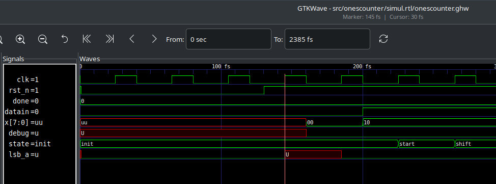
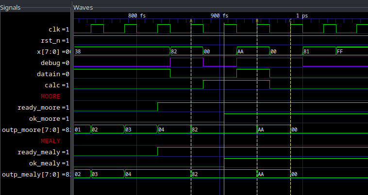
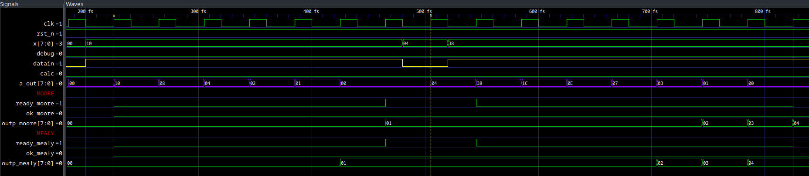
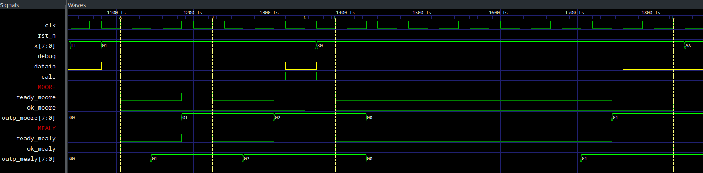

= Progetto 1: Ones Counter

Il dispositivo effettua il conteggio dei bit impostati ad `1` per una sequenza di vettori di bit iniettati al suo ingresso.

Il dispositivo utilizza le seguenti porte di input ed output:

.Descrizione porte dispositivo `onescounter`.
[#table_onescounter_IOports,subs="attributes+", reftext='{table-caption} {counter:tabnum}']
[cols="^2m,^2,6",options="header"]
|===

|Signal
|Direction
|Description

|OUTP
|OUT
|Total number of bits equal to '1' received on `X`.

|DATAIN
|IN
|Signals a new input data when set.

|CALC
|IN
|When set, signals that input data are finished.
Asks device to provide result.

|READY
|OUT
|Signals that the device is ready to receive a new data.

|OK
|OUT
|Signals that the device has finished the computation.
Result on `OUTP` is valid.
A new computation can start.

|===

.Diagramma dispositivo `onescounter`
[.center,svgbob-onescounter_ports, reftext='{figure-caption} {counter:fignum}']
[svgbob]
----
               +----------------+
  X [8] ------>|                |----> OUTP [8]
               |                |
DATAIN  ------>|  onescounter   |----> READY
               |                |
 CALC   ------>|                |----> OK
               +----------------+
----

Il dispositivo `onescounter` viene presentato con le seguenti modifiche:

. Versione 'Moore'.
. Versione 'Mealy'.
** Entrambe le versioni sono descritte in `ctrlunit.vhdl` in due architetture separate.
. Selezione dell'architettura della CTRL Unit tramite _generic_.
. Aggiunto segnale `DEBUG` che sovrascrive il registro `ONES` con il valore posto all'ingresso `X`.

[NOTE]
====
* L'operazione é realizzabile e valida solo quando `READY = 1`.
* La modifica con il segnale `DEBUG` é stata effettuata anteriormente alla divisione nelle due versioni, ed é quindi presentata in solo stile 'mealy'.
====

Il dispositivo viene consegnato con un testbench contenente le seguenti modifiche:

. Terminazione _graceful_ della simulazione al set del segnale `done`.
. Istanza simultanea di entrambe le versioni `moore` e `mealy` del DUT, input condivisi.
. Aggiunti `assert` per monitorare continuamente la corrispondenza tra gli output delle due versioni del dispositivo.
. Aggiunta la funzione `t2s_ns` per formattare i tempi in ns quando stampati da report.

[#script_onescounter]
Per analizzare ed elaborare il design ed eseguirne la simulazione é stato creato uno script bash, che viene fornito, ed é utilizzabile come segue:

.Comando di esecuzione script `runSim_ghdl`
[source, console, reftext='{listing-caption} {counter:listnum}']
----
$ scripts/runSim_ghdl projects/01_onescounter
----

[NOTE]
====
Si verifichi che le dipendenze necessarie per eseguire lo script siano soddisfatte, come da sezione <<#script_ghdl>>.
====

Lo script richiede almeno un argomento, il path del progetto da simulare, che assuma la struttura directory come descritta nella <<#dir_struct, sezione dedicata>>.

Le operazioni eseguite dallo script sono le seguenti:

.Comandi eseguiti da `runSim_ghdl`, `onescounter`
[%unbreakable]
[source, console, reftext='{listing-caption} {counter:listnum}']
----
# Sposta la $PWD nel percorso indicato del progetto, sottocartella `simul.rtl`
pushd projects/01_onescounter/simul.rtl
# Analisi GHDL per tutti i file estratti da sources.vc
ghdl -a -v --std=93c    projects/01_onescounter/code/reg8.vhdl \
                        projects/01_onescounter/code/zerodetect.vhdl \
                        projects/01_onescounter/code/rshift.vhdl \
                        projects/01_onescounter/code/mux2x8.vhdl \
                        projects/01_onescounter/code/mux4x8.vhdl \
                        projects/01_onescounter/code/adder.vhdl \
                        projects/01_onescounter/code/datapath.vhdl \
                        projects/01_onescounter/code/ctrlunit.vhdl \
                        projects/01_onescounter/code/onescounter_pkg.vhdl \
                        projects/01_onescounter/code/onescounter.vhdl \
                        projects/01_onescounter/code/TB.vhdl
# Elaborazione
ghdl -e -v --std=93c tb
# Simulazione, salva wave-file in formato ghw
ghdl -r -v --std=93c --time-resolution=ns tb --wave=onescounter.ghw
# Invoca `gtkwave` per visualizzare il wave-file
gtkwave onescounter.ghw
# Al termine, ritorna alla directory iniziale
popd
----

Lo script estrae il path assoluto per ognuno dei file sorgente, per cui `projects` assumerá il valore dipendente dal percorso del sistema.

== Analisi dei File Sorgente

Il file `sources.vc` contiene la lista dei sorgenti utilizzati, che vengono di seguito elencati e brevemente descritti:

.Descrizione file sorgente
[#table_onescounter_sources,subs="attributes+", reftext='{table-caption} {counter:tabnum}']
[cols="25%,75%",options="header"]
|===
| File | Description

| `reg8.vhdl`
| Descrizione di un registro di larghezza 8 bit da usarsi nella rappresentazione strutturale.

| `zerodetect.vhdl`
| Descrizione di un comparatore con `0` di larghezza 8 bit da usarsi nella rappresentazione strutturale.

| `rshift.vhdl`
| Descrizione di uno right-shift-register di larghezza 8 bit da usarsi nella rappresentazione strutturale.

| `mux2x8.vhdl`
| Descrizione di un multiplexer 2 ingressi da 8 bit ciascuno, da usarsi nella rappresentazione strutturale.

| `mux4x8.vhdl`
| Descrizione di un multiplexer 4 ingressi da 8 bit ciascuno, da usarsi nella rappresentazione strutturale.

| `adder.vhdl`
| Descrizione di un semplice adder (senza carry out) da 8 bit da usarsi nella rappresentazione strutturale

| `datapath.vhdl`
| Descrizione del Datapath del dispositivo.
Contiene la versione comportamentale (architecture `s`) e strutturale (architecture `struct`).

| `ctrlunit.vhdl`
| Descrizione comportamentale della rete di controllo del dispositivo.
Contiene due architetture corrispondenti agli ASM chart versione `moore` e versione `mealy`.

| `onescounter_pkg.vhdl`
| Package che contiene la descrizione del componente `onescounter`.

| `onescounter.vhdl`
| Descrizione strutturale del dispositivo (top level).

| `TB.vhdl`
| Testbench che istanzia il DUT ed i suoi stimoli.

|===

Vengono presentati di seguito sezioni di codice rilevanti per il funzionamento dei sorgenti.

=== onescounter.vhdl
Al dispositivo é stato aggiunto un _generic_ di tipo testuale (_string_) per indicare quale architettura istanziare.

.Modifica generic architettura `onescounter`
[%unbreakable]
[source, vhdl, reftext='{listing-caption} {counter:listnum}']
----
    entity onescounter is
        generic
        (
            CTRL_TYPE	: string := "moore"
        );
        ...
----

Per mantenere la compatibilitá con lo standard VHDL-1993, sono stati utilizzati due costrutti `if ... generate ... end generate` per istanziare l'architettura desiderata.

.Istanza doppia architettura CU `onescounter`
[source.reduced-listing-text, vhdl, reftext='{listing-caption} {counter:listnum}']
----
    gen_mealy : if (CTRL_TYPE = "mealy") generate
        CTRL_mealy : entity work.ctrlunit(mealy)
        port map
        (
            CLK         => CLK,
            rst_n       => rst_n,
            DATAIN      => DATAIN,
            ...
            LSB_A       => LSB_A,
            zA          => zA
        );
    end generate;

    gen_moore : if (CTRL_TYPE /= "mealy") generate
        CTRL_moore : entity work.ctrlunit(moore)
        port map
        (
            CLK         => CLK,
            rst_n       => rst_n,
            DATAIN      => DATAIN,
           ...
            LSB_A       => LSB_A,
            zA          => zA
        );
    end generate;
----

[#source_dp]
=== datapath.vhdl

Per il registro `ONES` sono stati aggiunti diversi ingressi selezionabili rispetto alla versione originale, che sono riassunti nello spezzone:

.Modifica MUX `ONES_in`
[%unbreakable]
[source, vhdl, reftext='{listing-caption} {counter:listnum}']
----
    -- MUX for ONES
    ONES_in <= (others => '0')                          when selONES = "00" else
                X                                       when selONES = "10" else
                (ONES_in'LEFT downto 1 => '0') & '1'    when selONES = "11" else
                adder1;
----

Considerando che ad ogni fronte di salita di `CLK` il segnale `ONES_in` viene registrato da `ONES`, la mappa di selezione del multiplexer al suo ingresso é:

.Esempio selettore mux `selOnes`
[#table_onesSel,subs="attributes+", reftext='{table-caption} {counter:tabnum}']
[cols="^2,8",options="header"]
|===
| selOnes
| Descrizione

| `"00"`
| Seleziona il valore `'0000_0000'`.

| `"01"`
| Seleziona il segnale in uscita dal sommatore `ONES + 1`.

| `"10"`
| Seleziona il valore `X` (<<sim_debug_input, funzione con input `DEBUG`>>).

| `"11"`
| Seleziona il valore `'0000_0001'`.

|===

=== TB.vhdl

Il testbench istanzia entrambe le architetture del dispositivo `onescounter` simultaneamente, raddoppiando solo i segnali di uscita e mantenendone invece i segnali di input unici.

.Modifica testbench `onescounter`
[%unbreakable]
[source, vhdl, reftext='{listing-caption} {counter:listnum}']
----
    DUT_moore : onescounter
    generic map
    (
        CTRL_TYPE => "moore"
    )
    port map
    (
        ...
    );

    DUT_mealy : onescounter
    generic map
    (
        CTRL_TYPE => "mealy"
    )
    port map
        ...
----

Sono stati quindi aggiunti degli `assert` per tenere monitorati i segnali di output che, in determinati momenti, sono da assumersi identici tra le due versioni.

.Assert `onescounter` corrispondenza architetturale
[%autofit]
[source, vhdl, reftext='{listing-caption} {counter:listnum}']
----
    assert not ((rst_n = '1') and
                (OK_mealy = '1' or OK_moore = '1') and
                (OUTP_mealy /= OUTP_moore))
        report "ERROR: OUTP output differs between DUTs when OK signal is set. Time: " & t2s_ns(now)
        severity error;

    assert READY_mealy = READY_moore
        report "ERROR: READY output differs between DUTs. Time: " & t2s_ns(now)
        severity error;

    assert OK_mealy = OK_moore
        report "ERROR: OK output differs between DUTs. Time: " & t2s_ns(now)
        severity error;
----

Considerato che GHDL utilizza il _femtosecondo_ quale unitá di tempo, é stata introdotta la funzione `t2s_ns` (_time to string ns_) per stampare coerentemente l'eventuale tempo di simulazione di un `assert` fallito.

.Funzione `t2s_ns`
[source, vhdl, reftext='{listing-caption} {counter:listnum}']
----
    function t2s_ns(t : time) return string is
        variable nano : integer := integer(t / 1 ns);
    begin
        return integer'image(nano) & " ns";
    end function;
----

Per terminare in maniera _graceful_ la simulazione, é stato rimosso l' `assert` di interruzione alla fine degli stimoli di test.

La generazione del clock é invece stata modificata come segue per fermarsi al set del segnale `done`:

.Processo generazione clock TB `onescounter`
[%autofit]
[%unbreakable]
[source, vhdl, reftext='{listing-caption} {counter:listnum}']
----
    clk_process : process
    begin
        if (done = 1) then
            wait;
        else
            if CLK = '0' then
                CLK <= '1';
                wait for CLK_SEMIPERIOD1;
            else
                CLK <= '0';
                wait for CLK_SEMIPERIOD0;
                count     <= std_logic_vector(unsigned(count) + 1);
                int_count <= int_count + 1;
            end if;
        end if;
    end process clk_process;
----

In assenza di costrutti errati che mettano indefinitamente in stallo la simulazione, GHDL terminerá la sua esecuzione quando tutti gli eventi si fermeranno a seguito del set del segnale `done`.

=== Asset data.txt
Il testbench utilizza un file esterno da cui leggere i dati da utilizzare per gli stimoli del Device Under Test.

Il file `assets/data.txt` é un testo ASCII contentente stringhe testuali da interpretarsi come valori binari.

Ogni iterazione di lettura del file si aspetta quattro elementi, uno per riga, nel seguente ordine:

. Una stringa da 8 bit per l'ingresso `X`
. Un singolo bit per l'ingresso di `DEBUG`
. Un singolo bit per l'ingresso `DATAIN`
. Un singolo bit per l'ingresso `CALC`

Al termine di questo set di stimoli, una riga vuota viene scartata e utilizzata per separare i gruppi di segnali.
Per terminare il file ed il test occorre aggiungere una seconda riga vuota che verrá decodificata dal processo `read_file_process` quale trigger per la terminazione della simulazione.

<<<
== ASM Chart

Per la versione 'moore', il dispositivo `onescounter` rispecchia il seguente ASM chart:

// :page-layout: landscape
.ASM Chart `onescounter` versione 'moore'
[#fig_onescounter_asm_moore,reftext='{figure-caption} {counter:fignum}']
image::images/ASM-onescounter_moore.drawio.svg[align=center,pdfwidth=100%]

// :page-layout: portrait

NOTE: La funzionalitá del segnale `DEBUG` é stata comunque implementata in stile 'mealy'.

Come esplicitato nella sezione del diagramma relativo al datapath, al registro `ONES` é stato posto in ingresso un `mux` a 4 ingressi come spiegato nella sezione <<source_dp>>.

<<<

Il diagramma relativo alla versione 'mealy' é invece il seguente:

.ASM Chart `onescounter` versione 'mealy'
[#fig_onescounter_asm_mealy,reftext='{figure-caption} {counter:fignum}']
image::images/ASM-onescounter_mealy.drawio.svg[align=center,pdfwidth=100%]

Mentre il datapath é rimasto inalterato, l'utilizzo delle _conditional output box_ ha permesso di ridurre il numero degli stati, integrando la funzionalitá dello stato `INC` all'interno dello stato `SHIFT`.

La funzionalitá del segnale `DEBUG` corrisponde a quella della versione precedente.

Si nota come nella versione Mealy l'ottimizzazione risultante dalla rimozione dello stato `INC` a favore dell'utilizzo delle conditional output boxes, stimoli un incremento immediato del registro `ONES` rispetto alla versione Moore.
Questo verrá infatti osservato in fase di simulazione e verifica.

La decisione di fornire un testbench unico per stimolare simultaneamente le diverse architetture, viene argomentata dai seguenti motivi:

* Il datapath resta identico.
* Le specifiche sugli input/output restano identiche.
* La funzionalitá e le tempestiche del device rispetto ai suoi ingressi ed uscite non cambiano.

Si deduce quindi che, pur assumendo delle possibili variazioni di tempistiche interne alla macchina a stati, le due architetture si debbano comportare in maniera equivalente quando osservate alle loro porte.

== Risultati

Seguendo le fasi indicate nel paragrafo relativo allo <<#script_onescounter, script>>, si raccolgono le relative considerazioni in questa sezione.

=== Analisi ed elaborazione
Non sono state incontrate particolari criticitá nella fase di analisi ed elaborazione dei listati.

I sorgenti sono stati costruiti in modo da non causare warning od errori in questa fase, assumendo l'utilizzo dello standard VHDL-1993 con regole di binding aggiornate (_GHDL option_ `--std=93c` - default).

=== Simulazione

L'esecuzione del simulatore cosí generato da GHDL riporta alcuni warning, ed il completamento dei test secondo quanto impostato nel file `assets/data.txt`.

.Esempio esecuzione RTL Simulation `onescounter`
[source, console, reftext='{listing-caption} {counter:listnum}']
----
ghdl -r -v --std=93c  --time-resolution=ns  tb --wave=onescounter.ghw

Linking in memory
../../src/ieee/v93/numeric_std-body.vhdl:1710:7:@0ms:(assertion warning): NUMERIC_STD."=": metavalue detected, returning FALSE
../../src/ieee/v93/numeric_std-body.vhdl:1710:7:@0ms:(assertion warning): NUMERIC_STD."=": metavalue detected, returning FALSE
../../src/ieee/v93/numeric_std-body.vhdl:1710:7:@145ns:(assertion warning): NUMERIC_STD."=": metavalue detected, returning FALSE
../../src/ieee/v93/numeric_std-body.vhdl:1710:7:@145ns:(assertion warning): NUMERIC_STD."=": metavalue detected, returning FALSE
END simulation - cycle counter is 59
----

I primi due warning si riferiscono alla presenza di segnali _"uninitialized"_ all'inizio della simulazione (0ms).
Questi segnali sono gli input `X` e `DEBUG` del device.
Inoltre, a tempo 0, il segnale `rst_n` indica che c'é un reset in corso sul dispositivo.

I secondi warning si riferiscono allo stesso problema, ma al primo istante utile (fronte di clock) all'uscita dal reset, ossia a tempo 145ns come visibile nell'immagine.

.Segnali non inizializzati simulazione RTL `onescounter`
[#fig_onescounter_xprop,reftext='{figure-caption} {counter:fignum}']

In questo caso, essendo iniziato il funzionamento del dispositivo, il segnale `X` non ancora inizializzato viene ora acquisito nel registro `A` ed il suo bit meno significativo salvato in `LSB_A`.
Registrando valori non propriamente inizializzati si attiva quindi il warning.

Poiché gli stessi input vengono assegnati dal test sulla base di quanto letto nel file di `assets/data.txt`, che avviene solo all'uscita dal reset e con device pronto (`READY`), si assume che entrambi i gruppi di warnings siano "innoqui".
Inoltre il dispositivo si riconfigura correttamente anche nel caso della propagazione di `'U'` ai registri.

Per eliminare questi warnings occorrerebbe modificare il file di stimolo e la lettura relativa al fine di forzare l'inizializzazione dei segnali relativi all'istante 0, ma per le considerazioni precedenti si é scelto di non alterarne il comportamento rispetto all'originale.

=== Verifica del funzionamento
Il dispositivo é stato quindi simulato e verificato nel suo funzionamento attraverso test diretti ed ispezione manuale delle forme d'onda, e la corrispondenza del funzionamento tra architetture in maniera automatica tramite gli assert sugli output.

Si presentano alcune sezioni rilevanti del test.

[#sim_debug_input]
==== Funzione DEBUG input

Il funzionamento del segnale `DEBUG` é stato stimolato con le sequenze presenti in `assets/data.txt`:

.Sequenza test `onescounter`: segnale `DEBUG`
[source, ascii, reftext='{listing-caption} {counter:listnum}']
----

    10000010    # 0x82
    1           # DEBUG
    0           # DATAIN
    0           # CALC

    00000000    # 0x00
    0           # DEBUG
    0           # DATAIN
    1           # CALC

    10101010    # 0XAA
    1           # DEBUG
    1           # DATAIN
    1           # CALC

    00000000    # 0x00
    1           # DEBUG
    0           # DATAIN
    0           # CALC

----

Dove il vettore di bit della prima riga si richiede venga immediatamente registrato in `ONES` al set di `DEBUG`.

L'output `OUTP` corrisponde al registro menzionato, e ci si aspetta che gli altri segnali di controllo (`DATAIN` e `CALC`) non abbiano effetto istantaneo.
Perció il loro funzionamento verrá 'sovrascritto' da `DEBUG`.

Nell'immagine seguente é possibile osservare le transazioni che verificano questo comportamento.

.Forme d'onda sequenza test `onescounter`: segnale `DEBUG`
[#fig_onescounter_debug,reftext='{figure-caption} {counter:fignum}']

I marker **A**, **B** e **C** identificano i fronti del clock sul quale il segnale `DEBUG` viene letto e conseguentemente l'uscita `OUTP` viene
aggiornata con i valori attesi.

==== Funzionamento normale del dispositivo

Con il test proposto, risulta necessario osservare manualmente lo stato dei segnali di `onescounter` per verificarne il correto funzionamento secondo i requisiti.

Vengono presentate alcune transazioni esemplificative prese dalla sequenza di test.

.Sequenza test `onescounter`: esempio 1
[source, ascii, reftext='{listing-caption} {counter:listnum}']
----
# data.txt
00010000    # 0x10
0           # DEBUG
1           # DATAIN
0           # CALC

00000100    # 0x04
0           # DEBUG
0           # DATAIN
0           # CALC

00111000    # 0x38
0           # DEBUG
1           # DATAIN
0           # CALC
----

La sequenza inietta (`DATAIN @ 1`) un vettore con uno dei bit centrali ad `1`, al prossimo `READY` sostituisce il vettore di ingresso, ma non ne stimola l'acquisizione e per finire inietta dei dati con tre bit ad uno.

L'analisi dei segnali mostra che il conteggio e lo shift viene eseguito nei vari casi come da ASM chart.

.Forme d'onda sequenza test `onescounter`: esempio 1
[#fig_onescounter_datain,reftext='{figure-caption} {counter:fignum}']

Il segnale `a_out` in uscita dallo shift register, mostra come i bit vengano traslati per portarli al conteggio.
Si vede come il dispositivo si disponga immediatamente in attesa di un nuovo dato quando identifica il vettore `A` composto da soli zeri.

Si puó giá notare come le due architetture della Control Unit differenzino nell'istante di inizio del conteggio dei bit ad uno, con la versione in stile `mealy` in anticipo, come si era previsto a livello ASM chart.

La prossima sequenza mostra il comportamento al set del segnale `CALC` e l'impostazione del risultato corretto insieme all'output `OK`.

.Sequenza test `onescounter`: esempio 2
[source, ascii, reftext='{listing-caption} {counter:listnum}']
----
# data.txt
00000001    # 0x01
0           # DEBUG
1           # DATAIN
0           # CALC

00000001    # 0x01
0           # DEBUG
1           # DATAIN
0           # CALC

00000001    # 0x01
0           # DEBUG
0           # DATAIN
1           # CALC

10000000    # 0x80
0           # DEBUG
1           # DATAIN
0           # CALC

10000000    # 0x80
0           # DEBUG
0           # DATAIN
0           # CALC

10000000    # 0x80
0           # DEBUG
0           # DATAIN
1           # CALC
----

La sequenza inietta due volte il valore `0x01` per poi richiedere la computazione.
Si attende quindi il valore `2` all'uscita `OUTP`.
Successivamente inietta il valore `0x80` e ne richiede la computazione, aspettando il valore `1` su `OUTP`.

Nelle seguenti forme d'onda la verifica di quanto descritto.

.Forme d'onda sequenza test `onescounter`: esempio 2
[#fig_onescounter_calc,reftext='{figure-caption} {counter:fignum}']

Ai diversi marker, é possibile seguire la sequenza identificata ed i risultati attesi nei segnali di uscita.

L'interezza del test e gli altri casi non descritti sono eseguibili e verificabili con l'infrastruttura fornita.
Si considera quindi il buon funzionamento di base del dispositivo `onescounter` secondo le specifiche ed i requisiti, per quanto identificabile dalla breve sequenza di test diretti inclusi.

---