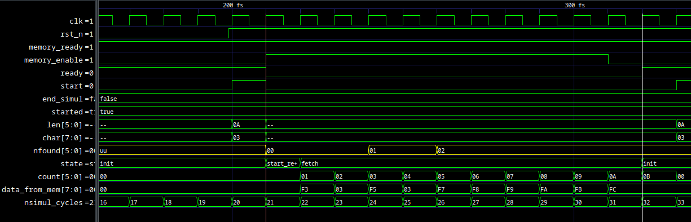
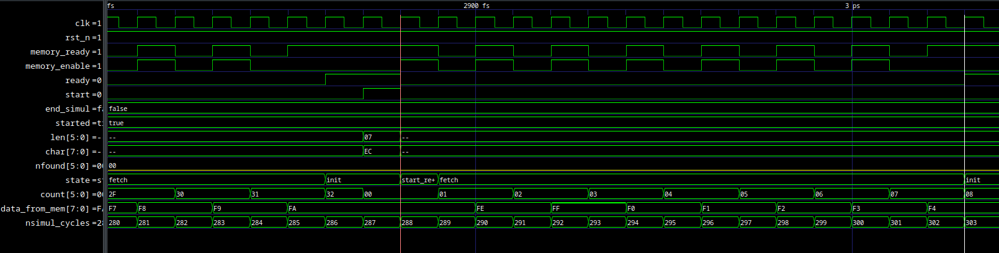
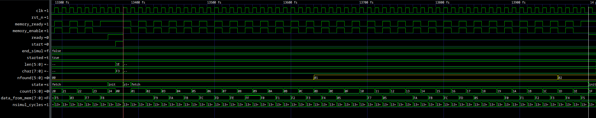

= Progetto 2: Search Character

Il dispositivo `search_chr` cerca un carattere (byte) in una memoria esterna.
La ricerca viene effettuata a partire da un indirizzo e per una certa lunghezza, entrambi valori forniti quali input del dispositivo.

Il dispositivo é descritto dalle seguenti porte di input ed output:

.Descrizione porte dispositivo `search_chr`
[%unbreakable]
[#table_search_chr_IOports,subs="attributes+", reftext='{table-caption} {counter:tabnum}']
[cols="^2m,^2,^2,6",options="header"]
|===

|Signal
|Direction
|Size
|Description

|ADDRESS
|IN
|32
|Indirizzo fornito da cui partire con la ricerca nella memoria esterna.

|CHAR
|IN
|8
|Identifica il byte da ricercare.

|LEN
|IN
|6
|Fornisce la lunghezza (in bytes) della ricerca da effettuare.

|READY
|OUT
|1
|Segnala che il dispositivo é pronto per effettuare una ricerca.

|nFOUND
|OUT
|`LEN\'length`
|Indica quante corrispondenze di `CHAR` sono state trovate nell'intervallo indicato.

|START
|IN
|1
|Segnala al dispositivo che i valori in input sono validi e richiede l'inizio di una ricerca.

|===

Per effettuare la ricerca nella memoria, il dispositivo necessita di un'interfaccia adatta.
Nella seguente tabella si identificano i segnali utilizzati per interfacciarsi con una generica memoria SRAM.

.Descrizione interfaccia di memoria
[%unbreakable]
[#table_search_chr_MemoryIF,subs="attributes+", reftext='{table-caption} {counter:tabnum}']
[cols="^2m,^2,^1,5",options="header"]
|===

|Signal
|Direction
|Size
|Description

|MEM_ENABLE
|OUT
|1
|Abilita una transazione (R/W) con la memoria.

|MEM_WE
|OUT
|1
|Segnala che la transazione sará una scrittura (`@1`) o una lettura (`@0`).

|MEM_ADDRESS
|OUT
|32
|Indirizzo dell'accesso.

|MEM_DATAIN
|IN
|8
|Dato contenuto in memoria all'indirizzo richiesto.

|MEM_DATAOUT
|OUT
|8
|Dato da scrivere in memoria all'indirizzo richiesto.

|MEM_READY
|IN
|1
|Segnala che la memoria ha terminato eventuali operazioni in corso ed é disponibile per una lettura o scrittura.

|===

.Diagramma dispositivo `search_chr`
[.center,svgbob-search_chr_ports, reftext='{figure-caption} {counter:fignum}']
[svgbob]
----
                    +----------------+
ADDRESS [32]------> |                |---> MEM_ENABLE
                    |                |---> MEM_WE
    CHAR [8]------> |                |
                    |   search_chr   |---> MEM_ADDRESS [32]
    LEN     ------> |                |<--- MEM_DATAIN [8]
                    |                |---> MEM_DATAOUT [8]
    nFOUND  <------ |                |
                    |                |<--- MEM_READY
                    +----------------+
                        ^       |
                        |       |
                        |       v
                      START   READY
----

Il dispositivo viene presentato nelle seguenti versioni:

[loweralpha, bold]
. <<version_a, Originale, secondo requisiti.>>
. <<memory_latency, Memoria a latenza variabile>>.
. <<version_c,Dispositivo senza ciclo 'di attesa' dopo una lettura in memoria.>>
. <<version_d,Testbench che riceve i dati di input da un file esterno.>>

Le quattro versioni sono da considerarsi incrementali, per cui ogni modifica precedente resta integrata nelle successive revisioni.

== Analisi dei File Sorgente

<<sources_file, Il file `sources.vc`>>, presente nella root-path di ogni versione di progetto, contiene la lista dei sorgenti utilizzati.
Di seguito un riassunto degli stessi:

.Descrizione file sorgente `search_chr`
[#table_search_chr_sources,subs="attributes+", reftext='{table-caption} {counter:tabnum}']
[cols="25%,75%",options="header"]
|===
| File | Description

| `search_chr.vhdl`
| Descrizione completa del dispositivo, Control Unit e Datapath.

| `memory.vhdl`
| Modello funzionale della memoria esterna da usarsi in congiunzione con il dispositivo.

| `TB.vhdl`
| Testbench che istanzia la memoria, il DUT ed i suoi stimoli.

|===

[#version_a]
=== search_chr.vhdl

Il dispositivo é completamente descritto in questo file sorgente, utilizzando uno stile a singolo processo per la macchina a stati della parte di controllo.
I segnali della control unit sono generati da degli statement concorrenti in stile 'compatto'.

Per esempio, considerando il segnale `loadCOUNT`:

.Esempio statement inline
[%unbreakable]
[source, vhdl, reftext='{listing-caption} {counter:listnum}']
----
    loadCOUNT   <= '1' when state = INIT or
                          (state = FETCH and MEM_READY = '1')
                   else '0';
----

Il datapath é composto da costrutti sequenziali _in-line_ per descrivere i registri, dove i relativi segnali combinatori sono descritti da statement concorrenti.

Anche per le modifiche operate sulle componenti del dispositivo si é deciso di mantenere lo stile più aderente possibile all'originale.

Il dispositivo `search_chr` gestisce una semplice macchina a stati finiti ed i relativi segnali di controllo per i seguenti scopi:

* Acquisire gli input di definizione della ricerca da eseguire.
* Preparare gli output verso la memoria in lettura.
* Ricevere i dati iterativamente nel segmento indicato.
* Confrontare e contare i byte corrispondenti all'elemento di ricerca.

Si veda la sezione <<asm_search_chr>> per altri dettagli ed una rappresentazinone della Control Unit e delle risorse del Datapath.

=== memory.vhdl

La memoria esterna é completamente descritta nel file `memory.vhdl`.

La stessa non si suppone sintetizzabile, ma é rappresentata in maniera funzionale per corrispondere al comportamento ed interfaccia di una generica implementazione tecnologica di memoria SRAM.

Il modello non specifica la _writing policy_, lasciando quindi l'uscita della stessa (`dataout`) non definita (`(others => '-')`) in fase di scrittura.
Questo fattore non é comunque impattante per il dispositivo sotto test il quale si interfaccia solamente in lettura con il presente modello.

Si nota in particolare il metodo di costruzione della memoria:

.Descrizione memoria VHDL
[source, vhdl, reftext='{listing-caption} {counter:listnum}']
----
    type ram_type is array (0 to 1023) of bit_vector(7 downto 0);
...
    shared variable RAM : ram_type := loadmem;
----

Il tipo `ram_type` viene costruito come un array bidimensionale di dimensioni `1024x8` bit, strutturato per modellare la memoria.
L'istanza della `shared variable RAM` rappresenta quindi il contenuto della memoria in simulazione.

Si rimarca l'apposizione dell'attributo `shared` per assicurare che la variabile `RAM` sia accessibile da _tutti_ i processi concorrenti che vogliono usarla.
Nel caso specifico del modello descritto in `memory.vhdl`, la presenza di un unico processo sequenziale, implica un solo _scope_ di esecuzione.
Tuttavia la qualifica `shared` é mantenuta per garantire la correttezza semantica anche in caso di future estesioni.

[#memory_loadmem]
La memoria cosí modellata viene inizializzata tramite la funzione `loadmem`, che legge il contenuto del file `assets/data.bin` e ne carica il contenuto nella variabile `RAM`.

Il formato atteso per il file é:

* un byte per riga.
* solo valori testuali `0` e `1`.

[#memory_latency]
==== Versione 'b': Memoria con latenza di più cicli

Per questa versione é stato aggiunto un parametro `MEM_LAT` per gestire la latenza.
Il parametro si aspetta un valore intero, positivo non nullo (VHDL: `positive`) che rappresenti il numero del ciclo di clock sul quale il dato letto sará disponibile.

In pratica, una latenza `MEM_LAT => 1` corrisponderá al comportamento originale (`ready <= '1';`), in cui il dato é immediatamente disponibile al ciclo di clock successivo alla richiesta.

Una latenza superiore, per esempio `MEM_LAT => 3`, renderá il dato disponibile al _terzo_ ciclo di clock, e cosí discorrendo.
Il seguente diagramma esemplifica le due transazioni descritte.

.Diagramma comportamento segnali di memoria a latenza variabile
[wavedrom, , svg, subs="attributes",reftext='{figure-caption} {counter:fignum}']
....
{ signal: [
  { name: "clk",  	wave: 'p...|......' },
  {},
  { name: 'enable', wave: '010.|.10...' },
  { name: 'address',wave: 'x=x.|.=x...',	data: ["A0", "A1"] },
  { name: 'we', 	wave: '0...|......' },
  { name: 'dataout',wave: 'x.=.|....=.',	data: ["D0", "D1"] },
  { name: 'ready', 	wave: 'x01x|.0..10' },
],

  head: {text:
  ['tspan',
    'Latenza 1',
    '                                       ',
    'Latenza 3',
  ]
},
}
....

Dopo aver sperimentato una soluzione in cui gli ingressi venivano registrati e "trasportati" all'istante di lettura desiderato dalla latenza, si é scelto di seguire un'implementazione differente creando invece una catena di registri sui segnali di uscita.

Si veda la sezione <<bug_b_mem_lat, Risultati>>, per le considerazioni sulle differenze di approccio.

.Modifiche modello di memoria a latenza variabile
[%autofit]
[%unbreakable]
[source, vhdl, reftext='{listing-caption} {counter:listnum}']
----
entity memory is
    generic (
        MEM_LAT : positive := 1
    );
...
architecture s of memory is
...
    type sequencer_type is array (0 to MEM_LAT-1) of std_logic_vector(dataout'RANGE);
    signal seq_dataout  : sequencer_type                    := (others => (others => '0') ) ;
    signal seq_ready    : std_logic_vector(0 to MEM_LAT-1)  := (others => '0') ;
...
    process(CLK)
    begin
        if rising_edge(CLK) then
            -- Synchronizer chain
            seq_ready(MEM_LAT-1)    <= '0';
            for i in MEM_LAT-1 downto 1 loop
                if seq_ready(i) = '1' then
                    seq_dataout(i-1)    <= seq_dataout(i);
                end if;
                seq_ready(i-1)      <= seq_ready(i);
            end loop;

            if enable = '1' then
                seq_ready(MEM_LAT-1) <= '1';
                if we = '1' then
                    RAM(to_integer(unsigned(address))) := to_bitvector(datain);
                    seq_dataout(MEM_LAT-1) <= (others => '-'); -- writing policy not specified
                else
                    seq_dataout(MEM_LAT-1) <= to_stdlogicvector(RAM(to_integer(unsigned(address))));
                end if;
            end if;
        end if;
    end process;
...
    dataout <= seq_dataout(0);
    ready   <= seq_ready(0);
...
end s;
----

Si é aggiunto un tipo personalizzato per creare una "pipeline" di registri ad 8 bit (`std_logic_vector`) denominato `sequencer_type`.
Per il segnale di `ready` invece si é semplicemente utilizzato un vettore di `std_logic`.

Nel processo sequenziale principale sono state effettuate le modifiche salienti.
In primo luogo si nota l'inserimento di una catena di registri collegati in cascata come nel caso di un sincronizzatore.
Nel costrutto `for...in...loop`, controllato dal parametro `MEM_LAT`, si collegano i flip-flop interni fino all'ultimo (indice `0`), mentre i flip-flop di indice più alto (`MEM_LAT-1`) vengono sovrascritti dai segnali utili alla memoria nel momento in cui questa viene abilitata.

Per mantenere il comportamento dell'output `dataout` simile all'originale, si é aggiunto un controllo al load di ogni stadio della sequenza `seq_dataout`.
La registrazione dello stadio precedente avviene solo nel caso in cui stia avvenendo il trasporto di un impulso di `ready`.
Gli output vengono infine collegati concorrentemente al valore del relativo registro di indice inferiore.

[%unbreakable]
[NOTE]
====
Tale scelta permette di mantenere la struttura di accesso alla memoria identica all'originale, modificando solamente il comportamento dei segnali di uscita.

Si rimarca peró che il modello presentato _non inferisce_ una memoria a latenza variabile.
Rappresenta invece un modello funzionale della stessa, utile ai fini del progetto, ma completamente agnostica delle problematiche tecnologiche che richiederebbero la latenza di memoria qui rappresentata.
====

Poiché si considera questo componente non sintetizzabile, si accetta l'approssimazione funzionale data da questa scelta implementativa.

Per garantire il comportamento identico all'originale nel caso `MEM_LAT => 1`, e semplificarne la logica, sono stati utilizzati dei costrutti `if...generate` per sovrascrivere _l'extra buffering_ dei segnali in questo caso.

.Modifica memoria a latenza = 1
[source, vhdl, reftext='{listing-caption} {counter:listnum}']
----
gen_no_lat : if MEM_LAT = 1 generate
    seq_ready(0) <= '1';
    ...
end generate;
----

Il componente nella condizione descritta appare quindi identico all'originale, e non perderá alcun ciclo dovuto al _load_ dei registri.

La richiesta del tipo `positive` del _generic_ impone al tool di simulazione il controllo che il parametro inserito sia accettabile dall'implementazione.
Tuttavia si é scelto di introdurre, seppur in maniera ridondante, un `assert` che osservi la stessa regola e, in caso di violazione, stampi un messaggio di errore specifico terminando l'esecuzione.

.Assert per memoria a latenza variabile
[source, vhdl, reftext='{listing-caption} {counter:listnum}']
----
    assert MEM_LAT > 0
        report "ERROR: Generic parameter 'MEM_LAT' can't be 0 or a negative number "
        severity FAILURE;
----

=== TB.vhdl

Il testbench contenuto in questo file corrisponde al top-level della simulazione, ed istanzia le seguenti risorse:

* `rst_n` generator.
* `clk` generator e contatore di cicli.
* DUT (`search_chr`)
* memoria esterna (`memory.vhdl`)
* Processi e controlli per la gestione degli stimoli di test

Gli stimoli agli input del dispositivo sono raccolti in tre vettori di interi:

.Dettaglio stimoli DUT `search_chr`
[source, vhdl, reftext='{listing-caption} {counter:listnum}']
----

signal ADDRESSES    : array_of_integers(0 to 2) := ( 3,  5, 20);
signal CHARS        : array_of_integers(0 to 2) := ( 3,  3,  5);
signal LENS         : array_of_integers(0 to 2) := (10, 10, 15);

----

[%unbreakable]
[WARNING]
====
Rispetto alla versione originale, 'da slides', ai segnali é stato apposto un range definito per evitare l'errore specifico dello standard `--std=93c` di GHDL, con signature:

[%autofit]
```
../TB.vhdl:23:12:error: declaration of signal "ADDRESSES" with unconstrained array type "array_of_integers" is not allowed
    signal ADDRESSES    : array_of_integers := ( 3,  5, 20);
    ...
../TB.vhdl:25:12:error: (even with a default value)
```
====

Il processo principale del testbench implementa una semplice macchina a stati finiti.
Questa osserva il segnale `READY` del dispositivo sotto test per iterare progressivamente lo stimolo di una combinazione di input `{ADDRESS, CHAR, LEN}`, incrementalmente ottenuta dai segnali descritti sopra.
La selezione degli input avviene tramite statement concorrenti con segnali dipendenti dagli stati della FSM.
Quando tutte le '_terzine_' sono state elaborate, il test termina attivando il segnale `end_simul` dopo un'attesa di dieci cicli.

Non é presente alcun report testuale del risultato, per cui anche in questo progetto risulta necessario osservare manualmente i segnali tramite le forme d'onda generate da simulatore.

==== Versione 'b': Supporto memoria con latenza variabile

Con riferimento alla sezione <<memory_latency>> relativa al modello VHDL di memoria, il testbench ha dovuto subire delle modifiche per supportare la latenza variabile.

In primo luogo si é scelto di esporre lo stesso parametro `MEM_LAT` a livello _top_ del testbench, in modo da poterlo configurare da linea di comando utilizzando le opzioni di GHDL.

.Modifica testbench per memoria a latenza variabile
[%unbreakable]
[source, vhdl, reftext='{listing-caption} {counter:listnum}']
----
...
entity tb is
    generic (
        MEM_LAT : positive := 4
    );
end tb;
...
----

Viene anche aggiunto uno statement di `report` nel processo iniziale di generazione del segnale di reset, che stampa il valore del parametro su `stdout`.

Infine, la mappatura del parametro `MEM_LAT` viene fatta a livello di istanza della `entity work.memory`.

[#version_d]
==== Versione 'd': Testbench con input-data da file

La versione modificata del testbench introduce la possibilitá di determinare i dati da assegnare agli input prendendoli da un file esterno `assets/instr.txt`.

Ogni 'terzina' di segnali `{ADDRESS, CHAR, LEN}` viene descritta da gruppi di tre righe, separati da una riga vuota (`\n`), gruppi chiamati 'istruzioni' in questa versione.
Il processo é stato modificato per analizzare il file in questo modo, e per terminare la simulazione una volta usate tutte le istruzioni.

Per evitare di complicare eccessivamente il testbench con una riscrittura massiccia, si é mantenuto lo stile originale del conteggio delle 'istruzioni' che ha un valore massimo raggiungibile dato dalla costante

.Modifica testbench per massimo numero di test/istruzioni `search_chr`
[source, vhdl, reftext='{listing-caption} {counter:listnum}']
----
constant MAX_INSTR               : integer := 30;
----

[WARNING]
====
Il valore della costante `MAX_INSTR` deve corrispondere al numero di gruppi di istruzioni inserite in `assets/instr.txt`.

In caso contrario, il testbench potrebbe non funzionare come inteso o fallire giá a livello di elaborazione.
====

Per gestire la lettura dal file, una funzione impura `load_instr`, confrontabile con lo stile della funzione <<memory_loadmem,`loadmem` di `memory.vhdl`>>, carica gli input in una struttura buffer.

Questa struttura viene infine chiamata `instr_data` e corrisponde ad una _lista di vettori di interi_.
Nel processo di generazione del reset, e quindi di inizio della simulazione, é stato aggiunto il codice:

.Modifica testbench `search_chr` con istruzioni da file esterno
[%unbreakable]
[source, vhdl, reftext='{listing-caption} {counter:listnum}']
----
...
    ADDRESSES <= instr_data(0);
    CHARS     <= instr_data(1);
    LENS      <= instr_data(2);
...
----

creando cosí una corrispondenza diretta con il sistema di assegnazione dei segnali di input precedentemente implementato.
Diversamente dalla versione originale, i vettori `ADDRESSES`, `CHARS` e `LENS` sono ora determinati in lunghezza dalla costante `MAX_INSTRS`.
Allo stesso modo, il controllo della FSM sul numero di istruzioni completate é stato modificato per usare direttamente la costante `MAX_INSTRS`.

[#asm_search_chr]
== ASM Chart

Il dispositivo in versione originale implementa una `CTRL Unit` corrispondente al ASM-chart:

.ASM Chart `search_chr` versione originale (a)
[#fig_search_chr_orig,reftext='{figure-caption} {counter:fignum}']
image::images/ASM-search_chr_orig.drawio.svg[]

Si nota che, per ogni transazione con la memoria esterna, un ciclo viene 'sprecato' tra `FETCH` e `COMPARE`.

[#version_c]
La versione del dispositivo migliorata (versione `c`) risolve questa osservazione ed é rappresentata nel seguente ASM-chart:

.ASM Chart `search_chr` versione migliorata (c)
[#fig_search_chr_improved,reftext='{figure-caption} {counter:fignum}']
image::images/ASM-search_chr_improved.drawio.svg[]

In questa versione, il dispositivo effettua entrambe le operazioni di `FETCH` e `COMPARE` in un unico stato e prepara la prossima richiesta verso la memoria appena questa diventa disponibile (`MEM_READY`).
A questo punto, si anticipa il conteggio delle transazioni, contando il numero di quelle effettuate invece di quelle ricevute.
Coerentemente la nuova richiesta verso la memoria utilizza l'indirizzo incrementato (l'uscita del sommatore) invece del valore registrato, ed il confronto del carattere da ricercare viene effettuato sul dato in ingresso (`MEM_DATAIN`) quando questo é pronto.

A questo punto, il collo di bottiglia é dato dalla memoria stessa, a costo di un leggero incremento di livelli di logica combinatoria nella control unit.
Si nota infatti la dipendenza della conditional output box da _due comparatori_ a loro volta interdipendenti.
Inoltre il secondo comparatore, `C = MEM_DATAIN`, risulta implementare una pratica sconsigliata: il segnale registrato `C` viene confrontato con un segnale esterno al dispositivo e di natura combinatoria.
Questa condizione predispone il design a comportamenti non-deterministici, metastabilitá o differenze comportamentali tra simulazione funzionale e sintesi.
Si assume peró che il segnale `MEM_DATAIN` sia stabile per la relazione di setup con il segnale `MEM_READY`, e che il valore sia mantenuto stabile almeno fino alla prossima richiesta alla memoria, ossia fino almeno il prossimo fronte di salita del clock.
In queste condizioni si accetta di comparare il valore appena presentato dalla memoria, vista l'implicita sincronia con il controllo del dispositivo `search_chr`.
In assenza di chiari limiti tecnologici, si é considerata comunque accettabile questa modifica vista la poca complessitá del dispositivo.
Alternativamente si dovrebbero predisporre degli opportuni circuiti "synchronizer" su tutti gli output della memoria in ingresso al DUT.

Il datapath comprende le risorse mostrate nell'immagine:

.Diagramma datapath `search_chr`
[#fig_search_chr_dp,reftext='{figure-caption} {counter:fignum}']
image::images/ASM-search_chr_dp.drawio.svg[]

Per il dispositivo migliorato (<<version_c, versione `c`>>) si risparmia solamente un registro, `D`, che non risulta più necessario vista la comparazione immediata con l'output `dataout` della memoria.

== Risultati

Come per il dispositivo `onescounter`, lo script `runSim_ghdl` puó essere usato per lanciare automaticamente le fasi di analisi, elaborazione e simulazione di `search_chr`.

.Esempio uso `runSim_ghdl` per simulare le diverse versioni di `search_chr`
[%unbreakable]
[source, console, reftext='{listing-caption} {counter:listnum}']
----
$ scripts/runSim_ghdl projects/02_search_chr/a_orig
$ scripts/runSim_ghdl projects/02_search_chr/b_mem_lat
$ scripts/runSim_ghdl projects/02_search_chr/c_improved
$ scripts/runSim_ghdl projects/02_search_chr/d_tb_file
----

[NOTE]
====
Si verifichi che le dipendenze necessarie per eseguire lo script siano soddisfatte, come da sezione <<#script_ghdl>>.
====

I comandi estrapolati dallo script sono come da esempio, assumendo di testare la versione `a_orig`:

.Esempio comandi `runSim_ghdl`, `search_chr` versione a
[%autofit]
[%unbreakable]
[source, bash, reftext='{listing-caption} {counter:listnum}']
----
    # Sposta la $PWD nel percorso indicato del progetto, sottocartella `simul.rtl`
pushd projects/02_search_chr/a_orig/simul.rtl
    # Analisi GHDL per tutti i file estratti da sources.vc
ghdl -a -v --std=93c    projects/02_search_chr/a_orig/code/search_chr.vhdl \
                        projects/02_search_chr/a_orig/code/memory.vhdl \
                        projects/02_search_chr/a_orig/code/TB.vhdl
    # Elaborazione
ghdl -e -v --std=93c tb
    # Simulazione, salva wave-file in formato ghw
ghdl -r -v --std=93c --time-resolution=ns tb --wave=a_orig.ghw
    # Invoca `gtkwave` per visualizzare il wave-file
gtkwave a_orig.ghw
    # Al termine, ritorna alla directory iniziale
popd
----

NOTE: Lo script estrae il path assoluto per ognuno dei file sorgente, per cui `projects` assumerá il valore dipendente dal percorso del sistema.

=== Versione 'b': Memoria con latenza variabile

Come anche segnalato nella sezione <<runSim_ghdl_generic, relativa allo script>>, é possibile utilizzare l'helper script configurando il test con diversi valori di latenza per la simulazione.

.Esempio `runSim_ghdl`, `search_chr` versione b
[%autofit]
[source, console, reftext='{listing-caption} {counter:listnum}']
----
$ scripts/runSim_ghdl projects/02_search_chr/b_mem_lat MEM_LAT=1 # Corrispondente alla versione 'a'
$ scripts/runSim_ghdl projects/02_search_chr/b_mem_lat MEM_LAT=4 # Corrispondente alla versione 'b' in default
$ scripts/runSim_ghdl projects/02_search_chr/b_mem_lat MEM_LAT=15 # latenza di 15 cicli
----

[#bug_b_mem_lat]
==== Problematiche riscontrate

La prima versione prevedeva un'implementazione differente rispetto a quella descritta e consegnata insieme al presente documento.
Il modello di memoria a latenza configurabile utilizzava un approccio basato sulla registrazione degli input e di un contatore per calcolare la latenza.

I segnali di input venivano registrati al set del segnale `MEM_ENABLE`, mentre il contatore veniva caricato al valore `MEM_LAT-1`.
Successivamente il contatore decrementava fino a raggiungere il valore `"0"`, e gli output venivano impostati utilizzando il valore registrato di `MEM_ADDRESS`.

L'implementazione ha peró portato con se delle piccole differenze comportamentali del modello, in particolare riguardo all'impostazione di `dataout`.
Questi comportamenti non sono stati rilevati e non hanno causato differenze fino all'implementazione della versione migliorata di `search_chr` (`c`).
Confrontando ed incrementando il contatore dei caratteri simultaneamente appariva funzionalmente scorretto il ritardo introdotto dalla registrazione dei segnali nel modello di memoria.

Nel caso con `MEM_LAT=2`, la memoria impostava qundi il segnale di `MEM_READY` all'istante corretto, ma presentava i dati in output _al ciclo successivo_.

Nell'analisi e risoluzione di questo _bug_, si é considerato quindi l'approccio descritto nella sezione relativa ai sorgenti, <<memory_latency>>, che é stato mantenuto per le motivazioni ivi descritte.

=== Analisi ed elaborazione

Come per il dispositivo `onescounter`, non ci sono particolari considerazioni per questa fase.
I sorgenti non causano warning od errori in questa fase, assumendo l’utilizzo dello standard VHDL-1993 con regole di binding aggiornate (_GHDL option_ `--std=93c` - default).

Si nota invece il _print_ dei report introdotti nella <<version_d,versione D>> del testbench:

.Dettaglio report `search_chr` versione d
[%autofit]
[source, console, reftext='{listing-caption} {counter:listnum}']
----
...
/code/calcolatori_elettronici_2025/projects/02_search_chr/d_tb_file/code/TB.vhdl:51:17:(report note): Read values - ADDRESS: 687, CHAR: 61, LEN: 6
 called from: architecture "behav" of "tb" at /code/calcolatori_elettronici_2025/projects/02_search_chr/d_tb_file/code/TB.vhdl:12:14
/code/calcolatori_elettronici_2025/projects/02_search_chr/d_tb_file/code/TB.vhdl:51:17:(report note): Read values - ADDRESS: 343, CHAR: 130, LEN: 44
...
----

Questa conferma testuale corrisponde ai valori presenti in `assets/instr.txt`.

=== Simulazione

In fase di simulazione si riscontrano nuovamente i messaggi del punto prima, e quello relativo all'impostazione del generic `MEM_LAT`:

.Dettaglio report simulazione RTL, `search_chr` versione d
[%autofit]
[source, console, reftext='{listing-caption} {counter:listnum}']
----
$ scripts/runSim_ghdl projects/02_search_chr/d_tb_file MEM_LAT=4
...
/code/calcolatori_elettronici_2025/projects/02_search_chr/d_tb_file/code/TB.vhdl:51:17:(report note): Read values - ADDRESS: 343, CHAR: 130, LEN: 44
 called from: architecture "behav" of "tb" at /code/calcolatori_elettronici_2025/projects/02_search_chr/d_tb_file/code/TB.vhdl:12:14
Linking in memory
/code/calcolatori_elettronici_2025/projects/02_search_chr/d_tb_file/code/TB.vhdl:98:13:@0ms:(report note): Generic parameter check: MEM_LAT = 4
...
----

L'analisi a campione delle _waveform_ di alcune transazioni prese dalle istruzioni, mostrano un comportamento corretto del dispositivo e della memoria, con l'output `nfound` evidenziato in giallo.

.`search_chr` versione 'd' `MEM_LAT=1`. Ricerca 1
[%unbreakable]
[#table_search_chr_sim1,subs="attributes+", reftext='{table-caption} {counter:tabnum}']
[cols="^2m,^2m",options="header"]
|===
|Istruzione
|Contenuto Memoria

a|[source,ascii]
----
# Ricerca 1
3   # ADDRESS
3   # CHAR
10  # LEN
----
a|[source,ascii]
----
0x03 \| 11110011
0x04 \| 00000011    <-
0x05 \| 11110101
0x06 \| 00000011    <-
0x07 \| 11110111
0x08 \| 11111000
0x09 \| 11111001
0x0a \| 11111010
0x0b \| 11111011
0x0c \| 11111100
----


2+a|[#fig_search_chr_d_instr01,reftext='{figure-caption} {counter:fignum}']


|===

.`search_chr` versione 'd' `MEM_LAT=2`. Ricerca 6
[%unbreakable]
[#table_search_chr_sim6,subs="attributes+", reftext='{table-caption} {counter:tabnum}']
[cols="^2m,^2m",options="header"]
|===
|Istruzione
|Contenuto Memoria

a|[source,ascii]
----
# Ricerca 6
53  # ADDRESS
236 # CHAR (0xEC)
7   # LEN
----
a|[source,ascii]
----
0x35 \| 11111110
0x36 \| 11111111
0x37 \| 11110000
0x38 \| 11110001
0x39 \| 11110010
0x3a \| 11110011
0x3b \| 11110100
----

2+a|[#fig_search_chr_d_instr06,reftext='{figure-caption} {counter:fignum}']


|===

.`search_chr` versione 'd' `MEM_LAT=2`. Ricerca 22
[%unbreakable]
[#table_search_chr_sim22,subs="attributes+", reftext='{table-caption} {counter:tabnum}']
[cols="^2m,^2m",options="header"]
|===
|Istruzione
|Contenuto Memoria

a|[source,ascii]
----
# Ricerca 22
164 # ADDRESS (0xA4)
243 # CHAR (0xF3)
30  # LEN
----
a|[source,ascii]
----
0xa4 \| 11111000
0xa5 \| 11111001
0xaf \| 11110011    <-
0xb0 \| 11110100
...
0xbe \| 11110010
0xbf \| 11110011    <-
0xc0 \| 11110100
----

2+a|[#fig_search_chr_d_instr22,reftext='{figure-caption} {counter:fignum}']


|===

Negli esempi precedenti si puó valutare il corretto funzionamento del dispositivo e dell'infrastruttura usata per verificarlo.
Le istruzioni contenute nel file `assets/instr.txt` sono state generate casualmente a partire dal set iniziale, e potrebbero dunque essere migliorate costruendo _corner-cases_ utili a stressare il DUT in situazioni particolari.
Si ritiene comunque che il funzionamento ottenuto sia sufficientemente aderente ai requisiti richiesti secondo le simulazioni effettuate.

---
