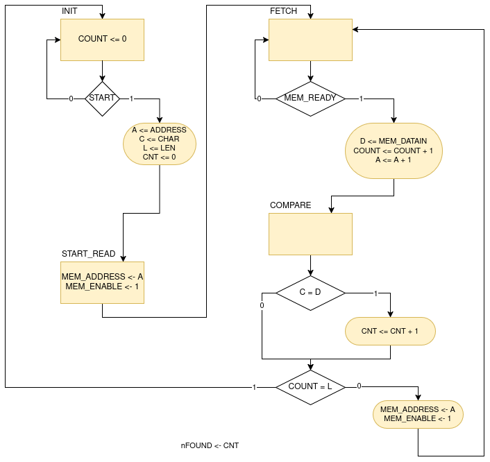
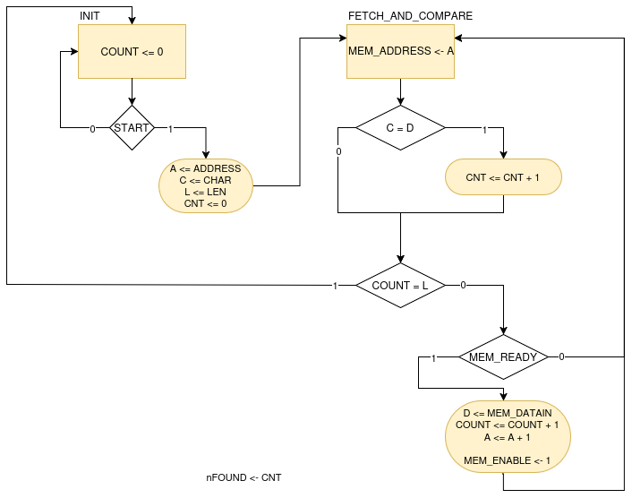

= Search Character

Il dispositivo `search_chr` cerca un carattere (byte) in una memoria esterna.
La ricerca viene effettuata a partire da un indirizzo e per una certa lunghezza, entrambi valori forniti quali input del dispositivo.

Per implementare questa funzionalitá il dispositivo é descritto dalle seguenti porte di input ed output:

[table_search_chr_IOports,subs="attributes+"]
[cols="^2m,^2,^2,6",options="header"]
|===

|Signal
|Direction
|Size
|Description

|ADDRESS
|IN
|32
|Indirizzo fornito da cui partire con la ricerca nella memoria esterna.

|CHAR
|IN
|8
|Identifica il byte da ricercare.

|LEN
|IN
|6
|Fornisce la lunghezza (in bytes) della ricerca da effettuare.

|READY
|OUT
|1
|Segnala che il dispositivo é pronto per effettuare una ricerca.

|nFOUND
|OUT
|`LEN\'length`
|Indica quante corrispondenze di `CHAR` sono state trovate nell'intervallo indicato.

|START
|IN
|1
|Segnala al dispositivo che i valori in input sono validi e richiede l'inizio di una ricerca.

|===

Per effettuare la ricerca nella memoria, il dispositivo necessita di un interfaccia adatta.
Nella seguente tabella si identificano i segnali utilizzati per interfacciarsi con una generica memoria SRAM.

[table_search_chr_MemoryIF,subs="attributes+"]
[cols="^2m,^2,^1,5",options="header"]
|===

|Signal
|Direction
|Size
|Description

|MEM_ENABLE
|OUT
|1
|Abilita una transazione (R/W) con la memoria.

|MEM_WE
|OUT
|1
|Segnala che la transazione sará una scrittura (`@1`) o una lettura (`@0`).

|MEM_ADDRESS
|OUT
|32
|Indirizzo della transazione.

|MEM_DATAIN
|IN
|8
|Dato contenuto in memoria all'indirizzo richiesto.

|MEM_DATAOUT
|OUT
|8
|Dato da scrivere in memoria all'indirizzo richiesto.

|MEM_READY
|IN
|1
|Segnala che la memoria ha terminato eventuali operazioni in corso ed é disponibile per una lettura o scrittura.

|===

[.center,ditaa-search_chr_ports]
[ditaa]
----
                    +----------------+
ADDRESS (32)------> |                |---> MEM_ENABLE
                    |                |---> MEM_WE
    CHAR (8)------> |                |
                    |   search_chr   |---> MEM_ADDRESS (32)
    LEN     ------> |                |<--- MEM_DATAIN (8)
                    |                |---> MEM_DATAOUT (8)
    nFOUND  <------ |                |
                    |                |<--- MEM_READY
                    +----------------+
                        ^       |
                        |       |
                        |       v

                      START   READY
----

Il dispositivo viene presentato nelle seguenti versioni:

[loweralpha]
. Originale, secondo requisiti.
. Memoria a latenza variabile.
. Dispositivo senza ciclo 'di attesa' dopo una lettura in memoria.
. Testbench che riceve i dati di input da un file esterno.

== Analisi dei File Sorgente
== ASM Chart

Il dispositivo in versione originale implementa una `CTRL Unit` corrispondente al ASM-chart:

Si nota che, per ogni transazione con la memoria esterna, un ciclo viene 'sprecato' nello stato `START_READ` per preparare l'indirizzo ed il segnale di enable, mentre si attende il dato in uno stato diverso (`FETCH`).
Inoltre la memoria viene abilitata, sempre in `START_READ`, assumendo che sia pronta, ma senza averne verificato l'effettiva disponibilitá con il segnale `MEM_READY`.

La versione del dispositivo migliorata risolve entrambe queste osservazioni ed é rappresentata nel seguente ASM-chart:

In questa versione, il dispositivo:

. Verifica la disponibilitá della memoria prima di effettuare una lettura.
.

== Risultati
=== Analisi ed elaborazione
=== Simulazione
=== Verifica del funzionamento
