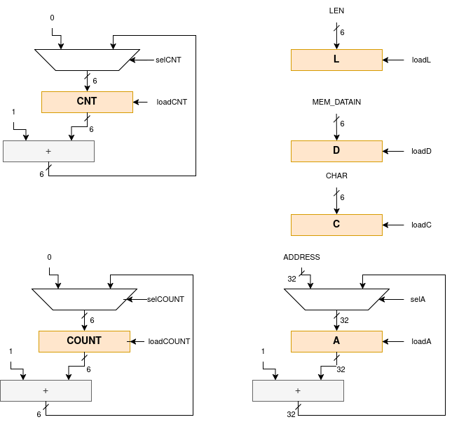

= Search Character

Il dispositivo `search_chr` cerca un carattere (byte) in una memoria esterna.
La ricerca viene effettuata a partire da un indirizzo e per una certa lunghezza, entrambi valori forniti quali input del dispositivo.

Per implementare questa funzionalitá il dispositivo é descritto dalle seguenti porte di input ed output:

[table_search_chr_IOports,subs="attributes+"]
[cols="^2m,^2,^2,6",options="header"]
|===

|Signal
|Direction
|Size
|Description

|ADDRESS
|IN
|32
|Indirizzo fornito da cui partire con la ricerca nella memoria esterna.

|CHAR
|IN
|8
|Identifica il byte da ricercare.

|LEN
|IN
|6
|Fornisce la lunghezza (in bytes) della ricerca da effettuare.

|READY
|OUT
|1
|Segnala che il dispositivo é pronto per effettuare una ricerca.

|nFOUND
|OUT
|`LEN\'length`
|Indica quante corrispondenze di `CHAR` sono state trovate nell'intervallo indicato.

|START
|IN
|1
|Segnala al dispositivo che i valori in input sono validi e richiede l'inizio di una ricerca.

|===

Per effettuare la ricerca nella memoria, il dispositivo necessita di un interfaccia adatta.
Nella seguente tabella si identificano i segnali utilizzati per interfacciarsi con una generica memoria SRAM.

[table_search_chr_MemoryIF,subs="attributes+"]
[cols="^2m,^2,^1,5",options="header"]
|===

|Signal
|Direction
|Size
|Description

|MEM_ENABLE
|OUT
|1
|Abilita una transazione (R/W) con la memoria.

|MEM_WE
|OUT
|1
|Segnala che la transazione sará una scrittura (`@1`) o una lettura (`@0`).

|MEM_ADDRESS
|OUT
|32
|Indirizzo della transazione.

|MEM_DATAIN
|IN
|8
|Dato contenuto in memoria all'indirizzo richiesto.

|MEM_DATAOUT
|OUT
|8
|Dato da scrivere in memoria all'indirizzo richiesto.

|MEM_READY
|IN
|1
|Segnala che la memoria ha terminato eventuali operazioni in corso ed é disponibile per una lettura o scrittura.

|===

[.center,ditaa-search_chr_ports]
[ditaa]
----
                    +----------------+
ADDRESS (32)------> |                |---> MEM_ENABLE
                    |                |---> MEM_WE
    CHAR (8)------> |                |
                    |   search_chr   |---> MEM_ADDRESS (32)
    LEN     ------> |                |<--- MEM_DATAIN (8)
                    |                |---> MEM_DATAOUT (8)
    nFOUND  <------ |                |
                    |                |<--- MEM_READY
                    +----------------+
                        ^       |
                        |       |
                        |       v

                      START   READY
----

Il dispositivo viene presentato nelle seguenti versioni:

[loweralpha]
. Originale, secondo requisiti.
. Memoria a latenza variabile.
. Dispositivo senza ciclo 'di attesa' dopo una lettura in memoria.
. Testbench che riceve i dati di input da un file esterno.

Le quattro versioni sono da considerarsi incrementali, per cui ogni modifica precedente resta integrata nelle successive revisioni.

== Analisi dei File Sorgente

Il file `sources.vc`, presente nella root-path di ogni versione di progetto, contiene la lista dei sorgenti utilizzati.
Di seguito un riassunto degli stessi:

[table_onescounter_sources,subs="attributes+"]
[cols="25%,75%",options="header"]
|===
| File | Description

| `search_chr.vhdl`
| Descrizione completa del dispositivo, Control Unit e Datapath.

| `memory.vhdl`
| Modello funzionale della memoria esterna da usarsi in congiunzione con il dispositivo.

| `TB.vhdl`
| Testbench che istanzia la memoria, il DUT ed i suoi stimoli.

|===

=== search_chr.vhdl

Il dispositivo é completamente descritto in questo file sorgente, utilizzando uno stile a singolo processo per la macchina a stati della parte di controllo.
I segnali della control unit sono generati da degli statement concorrenti in stile 'compatto'.

Per esempio, considerando il segnale `loadCOUNT`:

[source, vhdl]
----
    loadCOUNT   <= '1' when state = INIT or
                          (state = FETCH and MEM_READY = '1')
                   else '0';
----

Il datapath é composto da costrutti sequenziali _in-line_ per descrivere i registri nella forma:

[source, vhdl]
----
    COUNT   <= in_COUNT when rising_edge(CLK) and loadCOUNT = '1';
----

Dove i segnali combinatori sono descritti da statement concorrenti.

Anche per le modifiche operate sulle componenti del dispositivo si é deciso di mantenere lo stile più aderente possibile all'originale.

Il dispositivo `search_chr` gestisce una semplice macchina a stati finiti ed i relativi segnali di controllo per i seguenti scopi:

* Acquisire gli input di definizione della ricerca da eseguire.
* Preparare gli output verso la memoria in lettura.
* Ricevere i dati iterativamente nel segmento indicato.
* Confrontare e contare i byte corrispondenti all'elemento di ricerca.

Si veda la sezione <<asm_search_chr>> per altri dettagli ed una rappresentazinone della Control Unit e delle risorse del Datapath.

=== memory.vhdl

La memoria esterna é completamente descritta nel file `memory.vhdl`.

La stessa non si suppone sintetizzabile, ma é rappresentata in maniera funzionale per corrispondere al comportamento ed interfaccia di una generica implementazione tecnologica di memoria SRAM.

Il modello non specifica la _writing policy_, lasciando quindi l'uscita della stessa (`dataout`) non definito (`(others => '0')`) in fase di scrittura.
Questo fattore non é comunque impattante per il dispositivo sotto test il quale si interfaccia solamente in lettura con il presente modello di memoria.

Si nota in particolare il metodo di costruzione della memoria:

[source, vhdl]
----
    type ram_type is array (0 to 1023) of bit_vector(7 downto 0);
...
    shared variable RAM : ram_type := loadmem;
----

Il tipo `ram_type` viene costruito come un array bidimensionale di dimensioni `1024x8` bit, strutturato per modellare la memoria.
L'istanza della `shared variable RAM` rappresenta quindi il contenuto della memoria in simulazione.

Si rimarca l'apposizione dell'attributo `shared` per assicurare che la variabile `RAM` sia accessibile da _tutti_ i processi concorrenti che vogliono usarla.
Nel caso specifico del modello descritto in `memory.vhdl`, la presenza di un unico processo sequenziale, implica un solo _scope_ di esecuzione.
Tuttavia la qualifica `shared` é mantenuta per garantire la correttezza semantica anche in caso di future estesioni.

[#memory_loadmem]
La memoria cosí modellata viene inizializzata tramite la funzione `loadmem`, che legge il contenuto del file `assets/data.bin` e ne carica il contenuto nella variabile `RAM`.

Il formato atteso per il file é:

* un byte per riga.
* solo valori testuali `0` e `1`.

[#memory_latency]
==== Versione 'b': Memoria con latenza di più cicli

Per questa versione é stato aggiunto un parametro `MEM_LAT` per gestire la latenza.
Il parametro si aspetta un valore intero, positivo non nullo (VHDL: `positive`) che rappresenti il numero del ciclo di clock sul quale il dato letto sará disponibile.

In pratica, una latenza `MEM_LAT => 1` corrisponderá al comportamento precedente (`ready <= '1';`), in cui il dato é immediatamente disponibile al primo ciclo di clock in cui la lettura viene richiesta.

Una latenza superiore, per esempio `MEM_LAT => 3`, renderá il dato disponibile al _terzo_ ciclo di clock, e cosí discorrendo.
Il seguente diagramma esemplifica le due transazioni descritte.

[wavedrom, , svg, subs="attributes"]
....
{ signal: [
  { name: "clk",  	wave: 'p...|......' },
  {},
  { name: 'enable', wave: '010.|.10...' },
  { name: 'address',wave: 'x=x.|.=x...',	data: ["A0", "A1"] },
  { name: 'we', 	wave: '0...|......' },
  { name: 'dataout',wave: 'x.=.|....=.',	data: ["D0", "D1"] },
  { name: 'ready', 	wave: '0.1.|..0.1.' },
],

  head: {text:
  ['tspan',
    'Latenza 1',
    '                                       ',
    'Latenza 3',
  ]
},
}
....

Il codice é stato quindi modificato di conseguenza:

[source, vhdl]
----
entity memory is
    generic (
        MEM_LAT : positive := 1
    );
...
architecture s of memory is
...
    signal latcnt : integer := 0;

    signal Raddress : std_logic_vector(31 downto 0);
    signal Renable  : std_logic;
    signal Rwe      : std_logic;
    signal Rdatain  : std_logic_vector(7 downto 0);
...
    process(CLK)
    begin
        if rising_edge(CLK) then
            if enable = '1' then
                latcnt      <= MEM_LAT - 1;
                Raddress    <= address;
                Renable     <= enable;
                Rwe         <= we;
                Rdatain     <= datain;
            elsif latcnt /= 0 then
                latcnt <= latcnt - 1;
            end if;
        end if;
    end process;

    ready <= '1' when latcnt = 0 else '0';
...
end s;
----

Nello spezzone di codice appena illustrato é stato inserito un processo sequenziale che registra tutti i valori di input alla memoria ad ogni abilitazione della stessa (`enable = '1'`).
Viene anche inizializzato un contatore al valore `MEM_LAT - 1`, che verrá decrementato fino a raggiungere il valore `'0'`.
Questo contatore viene utilizzato per impostare il segnale `ready` ed abilitare l'output del dato al momento opportuno.

Il processo principale che modella la memoria ha quindi subito variazioni minime, atte solo ad introdurre l'utilizzo della versione registrata dei segnali di input.
I nomi dei registri corrispondono ai nomi degli input, preposti dalla lettera `R` nel nome del segnale.
Il processo sequenziale viene inoltre mascherato dal controllo sul contatore della latenza.

Si considera che questa versione modelli una memoria a latenza variabile (superiore ad `1`) secondo le richieste e che il comportamento sia assimilabile ad un'implementazione tecnologica equivalente.

Tuttavia resta un modello non sintetizzabile da tenere sotto controllo per evitare comportamenti errati ed inattesi, come nel caso di una configurazione del parametro `MEM_LAT` nullo o negativo.
La richiesta del tipo `positive` del _generic_ impone al tool di simulazione il controllo che questa situazione non si verifichi.
Tuttavia si é scelto di introdurre, seppur in maniera ridondante, un `assert` che osservi la stessa regola e, in caso di violazione, stampi un messaggio di errore specifico terminando l'esecuzione.

[source,vhdl]
----
    assert MEM_LAT > 0
        report "ERROR: Generic parameter 'MEM_LAT' can't be 0 or a negative number "
        severity FAILURE;
----

Si considera perció il modello funzionale ai fini dei test diretti alla simulazione del dispositivo `search_chr`.

=== TB.vhdl

Il testbench contenuto in questo file corrisponde al top-level della simulazione, ed istanzia le seguenti risorse:

* `rst_n` generator.
* `clk` generator e contatore di cicli.
* DUT (`search_chr`)
* memoria esterna (`memory.vhdl`)
* Processi e controlli per la gestione degli stimoli di test

Gli stimoli agli input del dispositivo sono raccolti in tre vettori di interi:

[source,vhdl]
----

signal ADDRESSES    : array_of_integers(0 to 2) := ( 3,  5, 20);
signal CHARS        : array_of_integers(0 to 2) := ( 3,  3,  5);
signal LENS         : array_of_integers(0 to 2) := (10, 10, 15);

----

[WARNING]
====
Rispetto alla versione originale, 'da slides', ai segnali é stato apposto un range definito per evitare l'errore specifico dello standard `--std=93c` di GHDL, con signature:

```
../TB.vhdl:23:12:error: declaration of signal "ADDRESSES" with unconstrained array type "array_of_integers" is not allowed
    signal ADDRESSES    : array_of_integers := ( 3,  5, 20);
    ...
../TB.vhdl:25:12:error: (even with a default value)
```
====

Il processo principale del testbench implementa una semplice macchina a stati finiti.
Questa osserva il segnale `READY` del dispositivo sotto test per iterare progressivamente lo stimolo di una combinazione di input `{ADDRESS, CHAR, LEN}`, incrementalmente ottenuta dai segnali descritti sopra.
La selezione dei segnali di input avviene tramite statement concorrenti con segnali dipendenti dagli stati della FSM.
Quando tutte le '_terzine_' sono state elaborate, il test termina attivando il segnale `end_simul` dopo un'attesa di dieci cicli.

Non é presente alcun report testuale del risultato, per cui anche in questo progetto risulta necessario osservare manualmente i segnali tramite le forme d'onda generate da simulatore.

==== Versione 'b': Supporto memoria con latenza variabile

Con riferimento alla sezione <<memory_latency>> relativa al modello VHDL di memoria, il testbench ha dovuto implementare delle modifiche per supportare la latenza variabile.

In primo luogo si é scelto di esporre lo stesso parametro `MEM_LAT` a livello _top_ del testbench, in modo da poterlo configurare da linea di comando utilizzando le opzioni di GHDL.

[source, vhdl]
----
...
entity tb is
    generic (
        MEM_LAT : positive := 4
    );
end tb;
...
----

Viene anche aggiunto uno statement di `report` nel processo iniziale di generazione del segnale di reset, che stampa il valore del parametro su `stdout`.

Infine, la mappatura del parametro `MEM_LAT` viene fatta a livello di istanza della `entity work.memory`.

==== Versione 'd': Testbench con input-data da file

La versione modificata del testbench introduce la possibilitá di determinare i dati da assegnare agli input prendendoli da un file esterno `assets/instr.txt`.

Ogni 'terzina' di segnali `{ADDRESS, CHAR, LEN}` viene descritta da gruppi di tre righe, separati da una riga vuota (`\n`), gruppi chiamati 'istruzioni' in questa versione.
Il processo é stato modificato per analizzare il file in questo modo, e per terminare la simulazione una volta usati tutte le istruzioni.

Per evitare di complicare eccessivamente il testbench senza una riscrittura massiccia, si é mantenuto lo stile originale di conteggio delle 'istruzioni' che ha un valore massimo raggiungibile dato dalla costante

[source,vhdl]
----
constant MAX_INSTR               : integer := 30;
----

[WARNING]
====
Il valore della costante `MAX_INSTR` deve corrispondere al numero di gruppi di istruzioni inserite in `assets/instr.txt`.

In caso contrario, il testbench potrebbe non funzionare come inteso o fallire giá a livello di elaborazione.
====

Per gestire la lettura dal file, una funzione impura `load_instr`, confrontabile con lo stile della funzione <<memory_loadmem,`loadmem` di `memory.vhdl`>>, carica gli input in una struttura buffer.

Questa struttura viene infine chiamata `instr_data` e corrisponde ad una _lista di vettori di interi_.
Nel processo di generazione del reset, e quindi di inizio della simulazione, é stato aggiunto il codice:

[source, vhdl]
----
...
    ADDRESSES <= instr_data(0);
    CHARS     <= instr_data(1);
    LENS      <= instr_data(2);
...
----

creando cosí una corrispondenza diretta con il sistema di assegnazione dei segnali di input precdentemente implementato.
Diversamente dalla versione originale, i vettori `ADDRESSES`, `CHARS` e `LENS` sono ora determinati in lunghezza dalla costante `MAX_INSTRS`.
Allo stesso modo, il controllo della FSM sul numero di istruzioni completate é stato modificato per usare direttamente la costante `MAX_INSTRS`.

[#asm_search_chr]
== ASM Chart

Il dispositivo in versione originale implementa una `CTRL Unit` corrispondente al ASM-chart:

image::images/ASM-search_chr_orig.drawio.png[]

Si nota che, per ogni transazione con la memoria esterna, un ciclo viene 'sprecato' nello stato `START_READ` per preparare l'indirizzo ed il segnale di enable, mentre si attende il dato in uno stato diverso (`FETCH`).
Inoltre la memoria viene abilitata, sempre in `START_READ`, assumendo che sia pronta, ma senza averne verificato l'effettiva disponibilitá con il segnale `MEM_READY`.

La versione del dispositivo migliorata risolve entrambe queste osservazioni ed é rappresentata nel seguente ASM-chart:

image::images/ASM-search_chr_improved.drawio.png[]

In questa versione, il dispositivo:

. Verifica la disponibilitá della memoria prima di effettuare una lettura.
.

Il datapath, per entrambe le versioni, comprende le risorse mostrate nell'immagine:




== Risultati

Come per il dispositivo `onescounter`, lo script `runSim_ghdl` puó essere usato per lanciare automaticamente le fasi di analisi, elaborazione e simulazione di `search_chr`.


[source,bash]
----
$ scripts/runSim_ghdl projects/02_search_chr/a_orig
$ scripts/runSim_ghdl projects/02_search_chr/b_mem_lat
$ scripts/runSim_ghdl projects/02_search_chr/c_improved
$ scripts/runSim_ghdl projects/02_search_chr/d_tb_file
----

NOTE : Si verifichi che le dipendenze necessarie per eseguire lo script siano soddisfatte, come da sezione <<#script_ghdl>>.

I comandi estrapolati dallo script sono come da esempio, assumendo di testare la versione `a_orig`:

[source,bash]
----
    # Sposta la $PWD nel percorso indicato del progetto, sottocartella `simul.rtl`
pushd <prj_path>/02_search_chr/a_orig/simul.rtl
    # Analisi GHDL per tutti i file estratti da sources.vc
ghdl -a -v --std=93c    <prj_path>/>02_search_chr/a_orig/code/search_chr.vhdl \
                        <prj_path>/>02_search_chr/a_orig/code/memory.vhdl \
                        <prj_path>/>02_search_chr/a_orig/code/TB.vhdl
    # Elaborazione
ghdl -e -v --std=93c tb
    # Simulazione, salva wave-file in formato ghw
ghdl -r -v --std=93c --time-resolution=ns tb --wave=a_orig.ghw
    # Invoca `gtkwave` per visualizzare il wave-file
gtkwave a_orig.ghw
    # Al termine, ritorna alla directory iniziale
popd
----

NOTE: Lo script estrae il path assoluto per ognuno dei file sorgente, per cui `<prj_path>` assumerá il valore dipendente dal percorso del sistema.

=== Versione 'b': Memoria con latenza variabile

Come anche segnalato nella sezione <<runSim_ghdl_generic, relativa allo script>>, é possibile quindi utilizzare l'helper script configurando il test con diversi valori di latenza per la simulazione.

[source, bash]
----
$ scripts/runSim_ghdl projects/02_search_chr/b_mem_lat MEM_LAT=1 # Corrispondente alla versione 'a'
$ scripts/runSim_ghdl projects/02_search_chr/b_mem_lat MEM_LAT=4 # Corrispondente alla versione 'b' in default
$ scripts/runSim_ghdl projects/02_search_chr/b_mem_lat MEM_LAT=15 # latenza di 15 cicli
----

=== Analisi ed elaborazione
=== Simulazione
